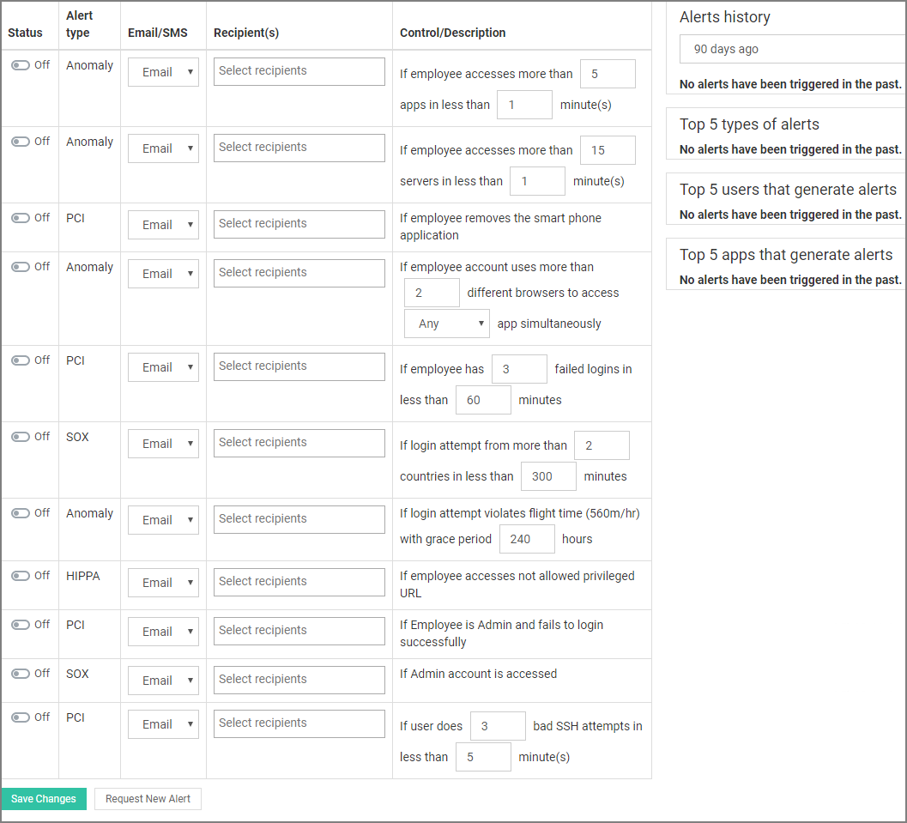
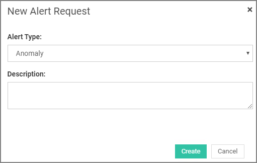

[title]: # (Alerts)
[tags]: # (thycotic access control)
[priority]: # (9)
# Alerts

Access Control helps you stay alert when organization users perform actions that can lead to security issues. You can enable alerts based on the action you want to monitor and receive notifications through email or SMS when the alert condition is met.

Under __Control/Description__ column, you can check the alert condition and edit the available filters. Select the users that will be notified when the condition is met and specify the kind of notification they will receive (email, SMS or both). Remember to set the status switch to On to activate the alert. Finally, click on __Save changes__ button for changes to take effect.

On the right hand side column of the main panel, you can find some useful statistics regarding alerts such as most common apps or users that generate alerts or the amount of alerts received the last 30, 60 or 90 days.

## Request New Alert

In case you need to receive an alert notification for an action that we have not included in the Alert panel, you can request for a new alert. Click on the __Request new alert__ button at the bottom of the page and from the popup window that comes up select the type of the alert and enter a small description. Onion ID team will receive your request and try to integrate the requested alert in the panel asap.

