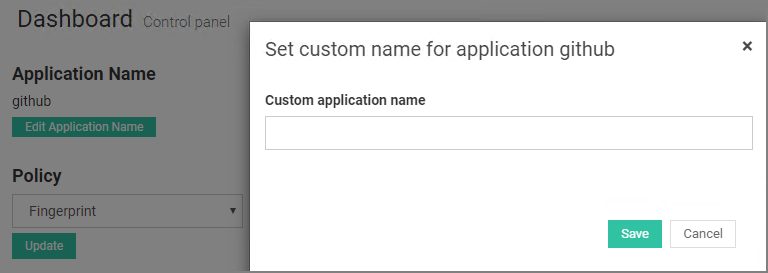
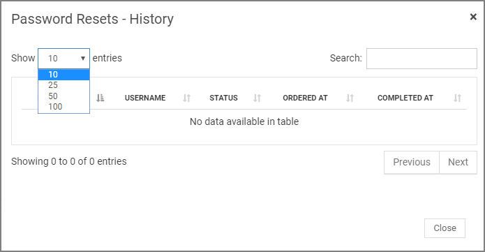
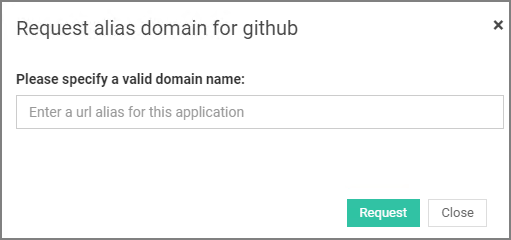
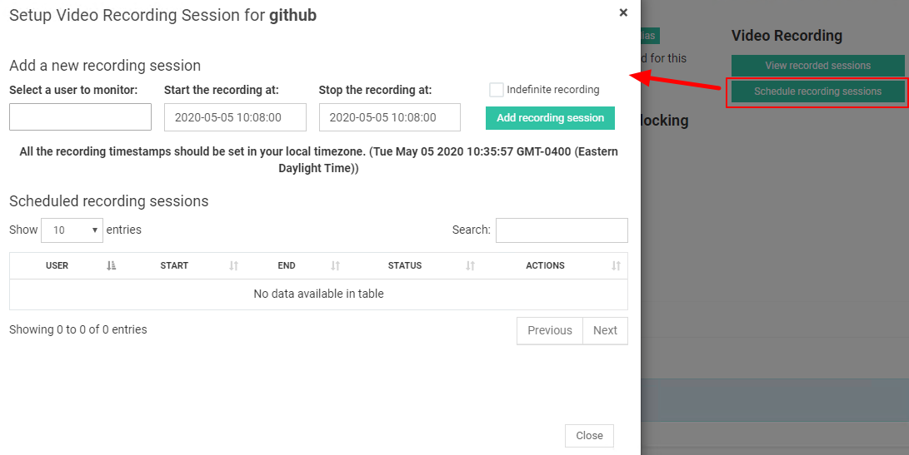
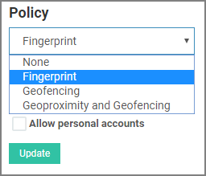
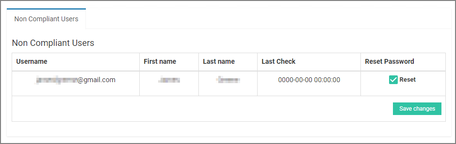
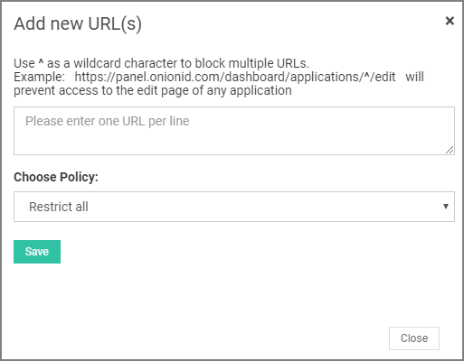
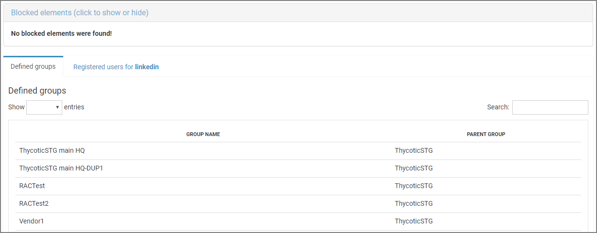
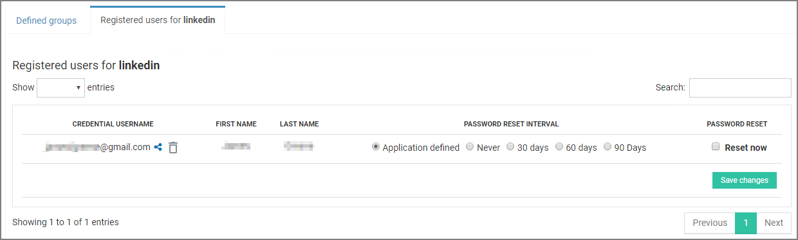
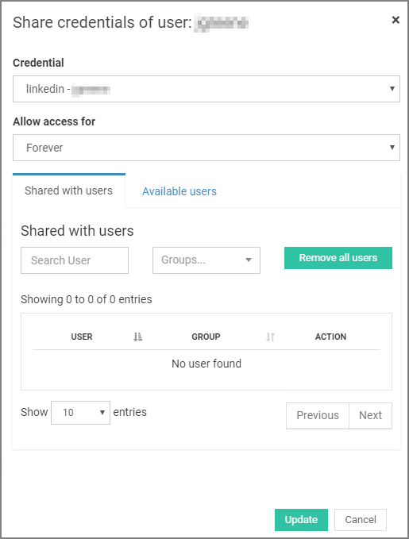

[title]: # (Configure Apps)
[tags]: # (thycotic access control)
[priority]: # (4)
# Configuring an Application 

Requirements: The application must exists on the panel and must be enabled. If not, refer to [Add Application](index.md) or [Enable/Disable Applications](enable-app.md) for more info.

To access an application’s configuration page click on __Configure__ on the app’s tile. From this control panel you have access to core access control options such as Policies, Blocked Elements, Privileged URLs, etc.

## Change Application Name

You can edit or set a custom name for an application by clicking __Edit Application Name__, located at the top left of the main control panel.

## Show Password Reset History

If you wish to track password reset history, click __View history__ in the middle of the page. From the displayed table, you can monitor every user that has been asked for a password reset, when this action occurred and was completed, as well as the current status of the reset process.

## Request Alias URL

If there is a web app that shares the same credentials with the application you are configuring but has a different URL, you can click __Request Alias__ and add this URL.

## Video Recording

### Schedule a Video Recording Session for a Web app

The Thycotic Access Controller provides you with the ability to schedule recordings per web app and per user. This way an admin can record a specific web app for a specified period of time and one or more users.

You can schedule a session by clicking __Schedule recording sessions__ on the right hand side of the main panel and then choose the user and the time period you would like to monitor. Click __Add recording session__ for the session to be scheduled. 

### View Recorded Sessions

Click __View recorded sessions__ on the right hand side of the main panel. A list of every completed session will be displayed sorted by user.

You can either watch the video for a session by clicking on __play__ or download it in mpeg-4 format to your machine via __Download__ button.

Recordings, which are running at the time, can be seen in the __Active Sessions__ tab. From there, you can watch the video recording up to that point, while in the background the recording continues.

### Set Policy for Application

In order to be able to login to an application using Tycotic Access Control browser extension, you need to set a policy first.

From the drop down menu that appears on the left side of the main panel, you can choose between a variety of policies such as TouchID, Air-sign, Geo Fencing, and Proximity etc. Remember to click __Update__ for changes to take effect.

>**Note**: Details regarding policies are covered under [Policies](../policies/index.md).

### Set Password Reset Interval

For every application, there is an option to reset all account passwords on a predefined interval. Click the respective drop-down menu and choose between Reset now, Daily and 30, 60 or 90 days.

Remember to click __Update__ for changes to take effect.

### Enable Mobile Browsing

If you wish your users to be able to login to an application through their mobile devices, you need to have __Enable mobile browsing__ checked. Users will be able to perform the actions listed below in order to login successfully to the app.

User interaction example:

1. Presses the Application button at the bottom of the screen.

   
2. Chooses Bridgeport Nextdoor application from the displayed app list.

   
3. Authenticates based on application’s policy (current is TouchID).

   
4. Selects an account for the app to login.

   
5. Access Controller automatically logs user in Bridgeport Nextdoor app.

   
6. User has successfully logged in.

   

### Set Location Based Blocking

If checked, organization users will be able to login only from a specific location, defined by their location during first login since this feature became enabled.

### Allow Personal Accounts

If checked, organization users will be able to mark an account as personal (i.e personal facebook account) and prevent organization administrators to perform a password reset on this specific account.

### Set Password Policy

As the organization administrator you are able to define the password policy of every user account for a particular application. Specifically, you can define password strength based on the following criteria:

* Password Length 
* Capital & lowercase letters 
* Numbers 
* Symbols 

When you finish setting the password policy, application user accounts that do not comply to your settings will be displayed in a table.

Select __Reset__ in the __Reset Password__ column in order for a custom-made password to be generated and assigned to the chosen account.

>**Note**: A process that checks for non-compliant user accounts runs in the background, checking accounts’ password strength and updates the list of non-compliant accounts.

### Set Privileged URLs

You are able to apply extra policies for different (application related) URLs in the __Privileged URLs__ section.

Privileged URLs are grouped by policy. Default policy is __Restrict all__ which prevents users to access URLs listed in the text area on the left of the policy.

* Αdd a new app related URL by typing the address in the policy related text area. You are free to add as many URLs as you want.
* Add a new policy for a group of URLs by clicking the “Add new” button. You are free to add as many policies as you want.

Remember to __Save changes__ for changes to take effect.

### View/Remove Blocked Elements

In the __Blocked Elements__ section you can review every element of an application’s page that might have been blocked through the administrator browser extension.

An administrator can block(protect) three type of elements:

* Clickable elements such as buttons and links
* Text
* Forms

>**Note**: Details regarding browser extension features are covered in [Browser Extensions](../be/index.md) section.

Both element type and code are displayed for better understanding and monitoring. If you wish to terminate blocking in specific element, just click __Remove element__.  

### View Defined Groups

Requirements: You need to have groups created in order to view anything in this section. Refer to [Create Groups](../groups/index.md) for more information.

The __Defined groups__ section consists of a list of every group that has been created by the administrator and group users have access to the application you are configuring. The group system conforms to parent-child hierarchy. The left column lists the name of each group and right column the name of its parent group.

### Registered Users for Application

Requirements: The access controller browser extension must be used to log in to an app at least once (by a user) for information to be displayed. To see how extension works see the [browser extension manual](TODO.md).

Lists stored user credentials and password information for this application (Figure 2.14).

Password reset interval default setting for each account is the one set for the entire application (See Set Password Reset Interval for more info). However, Onion ID provides you with the option to set custom interval for an account. You can choose between Never, 30, 60 or 90 days.  Remember to click “Save changes” button for changes to take effect.

#### Reset Password

If you wish to reset a password for an account, check __Reset now__ for the required account (credential username) and then click __Save changes__. The password reset server will handle the request and a Thycotic admin will be notified to complete this action.

>**Important**: This feature is available only for Cloud Service. On-prem installations require special configuration. Offline installations don’t support password reset.

#### Share Account Credentials

Click on __Share__ next to credential username, to share user credentials with other organization users.

From the pop-up drop-down, select the time period that credentials will remain shared among selected users. You can choose between Forever, 6, 12, 24 and 48 hours or set a custom window.

In order to select users to share credentials with, choose the desired ones from the list of __Available users__ and click __Add selected__. Follow the opposite procedure to remove users from the __Shared with users__ list. 
When you are done, click __Update__ for changes to take effect.

#### Delete Account Credentials

To delete an account for an application, click __Delete__ next to credential username.
