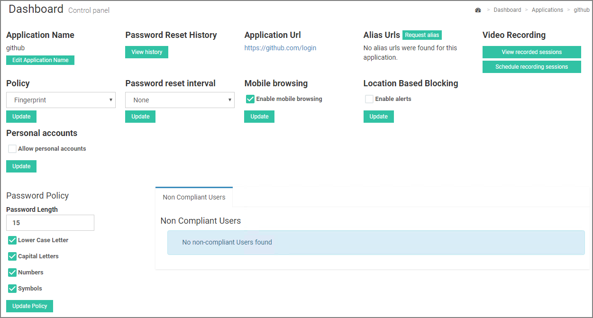
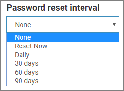

[title]: # (Configure Apps)
[tags]: # (thycotic access control)
[priority]: # (4)
# Configuring an Application 

To configure an application, it must exist on the panel __and__ be enabled. If the application needs to be added or enabled, refer to [Add Application](index.md) or [Enable/Disable Applications](enable-app.md).

Click __Configure__ on the app’s tile to access an application’s configuration page. From this control panel you have access to core access control options such as policies, blocked elements, privileged URLs, and monitoring.

## Change Application Name

Click __Edit Application Name__ at the top left of the main control panel to edit or set a custom name for an application.

## Show Password Reset History

Click __View history__ in the center of the page to track password reset history. From the displayed table, you can monitor every user that has been asked for a password reset, view the status of the reset, track when the reset was ordered, and verify the time that it was completed.

## Request Alias URL

Click __Request Alias__ to add a web application that shares credentials with the application that you are configuring but has a different URL. Enter the URL for the alias and click __request__.

## Video Recording

### Schedule a Video Recording Session for a Web app

The Thycotic Access Controller provides you with the ability to schedule recordings per web app and per user. The admin can record the use of a specific web app for a set period of time and capture the actions of one or more users.

To schedule a session, click __Schedule recording sessions__ on the right-hand side of the main panel and then choose the user and the time period you would like to monitor. Click __Add recording session__ for the session to be scheduled.

### View Recorded Sessions

Click __View recorded sessions__ on the right hand side of the main panel. A list of every completed session will be displayed sorted by user.
<!--
 -->

Click __Play__ to watch the recorded session, or click __Download__ to download the recording to your machine in mpeg-4 format.
<!--
 -->

The __Active Sessions__ tab shows sessions that are currently active. From there, you can watch the video recording up to that point while the recording continues in the background.

## Set Policy for Application

You will need to set a policy before using an application in the Thycotic Access Control browser extension.

From the drop down menu that appears on the left side of the main panel, you can choose between a variety of policies such as None, Fingerprint (TouchID), Geofencing, and Georoximity & Geofencing. Click __Update__ to implement the new policy.

>**Note**: Details regarding policies are covered under [Policies](../policies/index.md).

## Set Password Reset Interval

For every application, there is an option to reset all account passwords on a predefined interval. Click the Password reset interval drop-down menu and choose between Reset now, Daily, 30 days, 60 days or 90 days.

Click __Update__ for changes to take effect.

## Enable Mobile Browsing

Checking __Enable mobile browsing__ will allow your users to login to an application through their mobile devices. Refer to [Mobile Device Registration](../getting-started/mobile.md).

<!--
Users will be able to perform the actions listed below in order to login successfully to the app.
User interaction example:

1. Presses the Application button at the bottom of the screen.

   
2. Chooses Bridgeport Nextdoor application from the displayed app list.

   
3. Authenticates based on application’s policy (current is TouchID).

   
4. Selects an account for the app to login.

   
5. Access Controller automatically logs user in Bridgeport Nextdoor app.

   
6. User has successfully logged in.

   
-->
## Set Location Based Blocking

Checking __Set Location Based Blocking__ restricts user log-ins to a specified location as determined by the user's location at the time this feature was first enabled.

## Allow Personal Accounts

Checking __Allow Personal Accounts__ will allow users to mark an account as personal (i.e personal facebook account) and prevent organization administrators from performing a password reset on the specified account.

## Set Password Policy

As the organization administrator, you are able to define the password policy of every user account for each application. You can define password strength based on the following criteria:

* Password Length
* Lowercase Letters
* Capital Letters
* Numbers
* Symbols

User accounts that do not comply with the new password policy will be displayed in a table when you have finished setting the parameters.

Select __Reset__ in the __Reset Password__ column in order for a custom-made password to be generated and assigned to the chosen account.

>**Note**: A background process checks users' password strength and updates the list of non-compliant accounts.

## Set Privileged URLs

 The __Privileged URLs__ section allows you to apply extra policies for different application related URLS.

Privileged URLs are grouped by policy. The default policy is __Restrict all__ which prevents users from accessing URLs listed in the text area on the left of the policy.

* Αdd a new app related URL by typing the address in the policy related text area. You are free to add as many URLs as you want.
* Add a new policy for a group of URLs by clicking the “Add new” button. You are free to add as many policies as you want.

<!--
-->

Remember to __Save changes__ for changes to take effect.

## View/Remove Blocked Elements

In the __Blocked Elements__ section you can review every element of an application’s page that might have been blocked through the administrator browser extension.
<!-- 
 -->

An administrator can block(protect) three type of elements:

* Clickable elements such as buttons and links
* Text
* Forms

>**Note**: Details regarding browser extension features are covered in [Browser Extensions](../getting-started/be.md) section.

Both element type and code are displayed for better understanding and monitoring. If you wish to terminate blocking in specific element, just click __Remove element__.  

### View Defined Groups

Requirements: You need to have groups created in order to view anything in this section. Refer to [Create Groups](../groups/index.md) for more information.

The __Defined groups__ section consists of a list of every group that has been created by the administrator and group users have access to the application you are configuring. The group system conforms to parent-child hierarchy. The left column lists the name of each group and right column the name of its parent group.

## Registered Users for Application

Requirements: The access controller browser extension must be used to log in to an app at least once (by a user) for information to be displayed. To see how extension works see the [browser extension topic](../getting-started/be.md).

Lists stored user credentials and password information for this application (Figure 2.14).

Password reset interval default setting for each account is the one set for the entire application. However, you have the option to set custom intervals for an account. You can choose between Never, 30, 60 or 90 days. Remember to click “Save changes” button for changes to take effect.

### Reset Password

If you wish to reset a password for an account, check __Reset now__ for the required account (credential username) and then click __Save changes__. The password reset server will handle the request and a Thycotic admin will be notified to complete this action.

>**Important**: This feature is available only for Cloud Service. On-prem installations require special configuration. Offline installations don’t support password reset.

### Share Account Credentials

Click on __Share__ next to credential username, to share user credentials with other organization users.

From the pop-up drop-down, select the time period that credentials will remain shared among selected users. You can choose between Forever, 6, 12, 24 and 48 hours or set a custom window.

In order to select users to share credentials with, choose the desired ones from the list of __Available users__ and click __Add selected__. Follow the opposite procedure to remove users from the __Shared with users__ list.
When you are done, click __Update__ for changes to take effect.

#### Delete Account Credentials

To delete an account for an application, click __Delete__ next to credential username.
