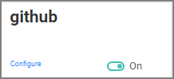

[title]: # (En-/Disable Applications)
[tags]: # (thycotic access control)
[priority]: # (4)
# Enable/Disable Applications

Requirements: The application must exists in the panel. If it does not exist, see [Add Application](index.md).

To setup the applications for your users,

1. Select __Applications__ from the left menu.
1. Under each listed application slide the on/off switch to enable or disable the application respectively.

   

>**Note**: Remember to add a new [access policy](../policies/index.md#create_an_application_policy) for each enabled application.
