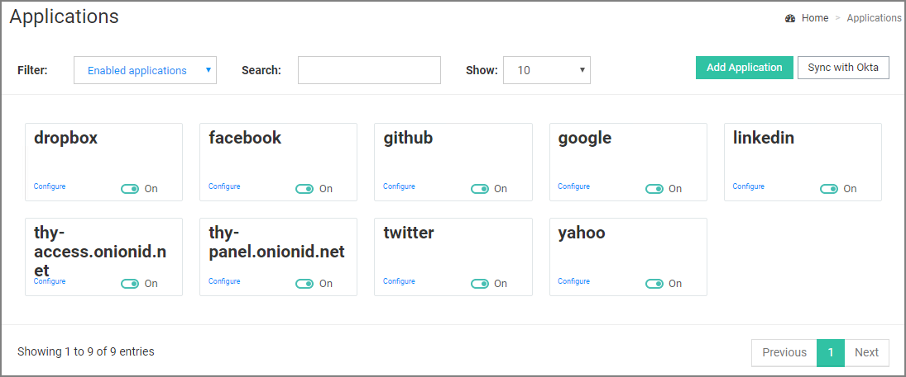
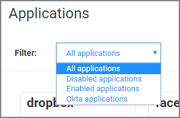
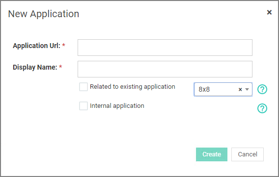

[title]: # (Applications)
[tags]: # (thycotic access control)
[priority]: # (3)
# Applications

Under Applications, you find the applications that have been made available in your company's portal. Use the applications area to add, configure, and remove applications.

To filter application based on state, select the Filter drop-down:

## Add an Application

If you wish to include an application that is not in the list of available applications, follow these steps:

1. Select __Applications__ from the left menu.
1. Click __Add Application__.

   
1. On the __New Application__ modal enter

   * the Application URL and
   * the Display Name.
   * specify if the application relates to an existing application and/or if the application is internal.
1. Click __Create__.

Thycotic will receive your request and provision this application in the list of available applications within 24 hours. You will be notified with an email when the app is available in your panel. The application will appear as disabled, so you will have to enable it as described [Enable/Disable Applications](enable-app.md).

The __Related to existing application__ option lets you specify if the application is related to an existing application already in the access controller. The application is being added instantly to your panel.

For example: If you would like to add Salesforce China, please specify a name like 'Salesforce China' and specify the appropriate URL and select this option followed by selecting the 'Salesforce' application from the list. Usage of this option allows you to have different application tiles for different URLs, which essentially point to the same application.

The __Internal application__ option means that the application you have added will only be available for your company's dashboard. This option should only be used for applications that are accessible from inside your company as opposed to the ones that can be accessed publicly.
