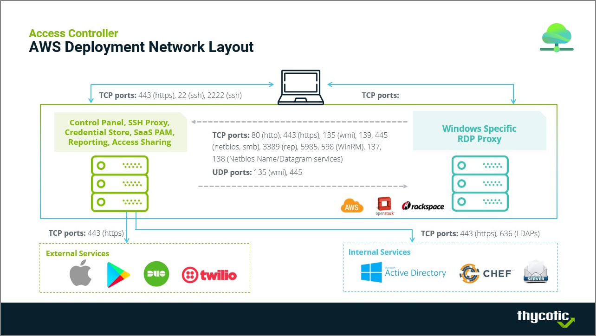
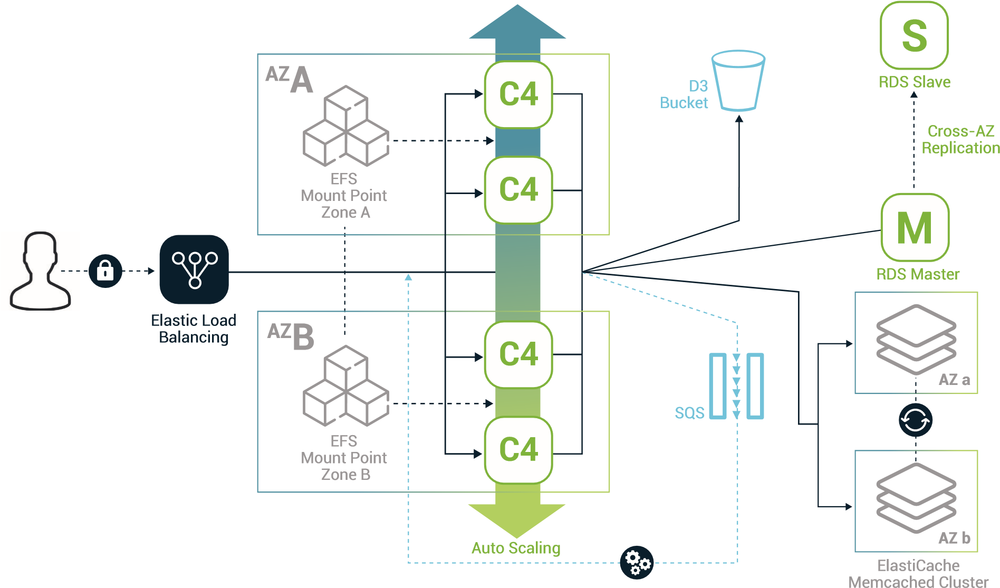
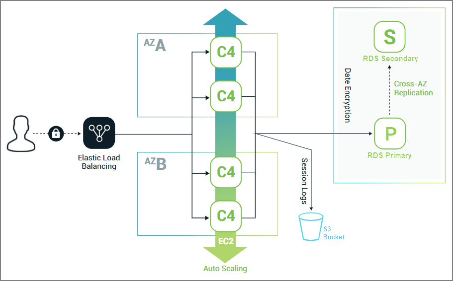
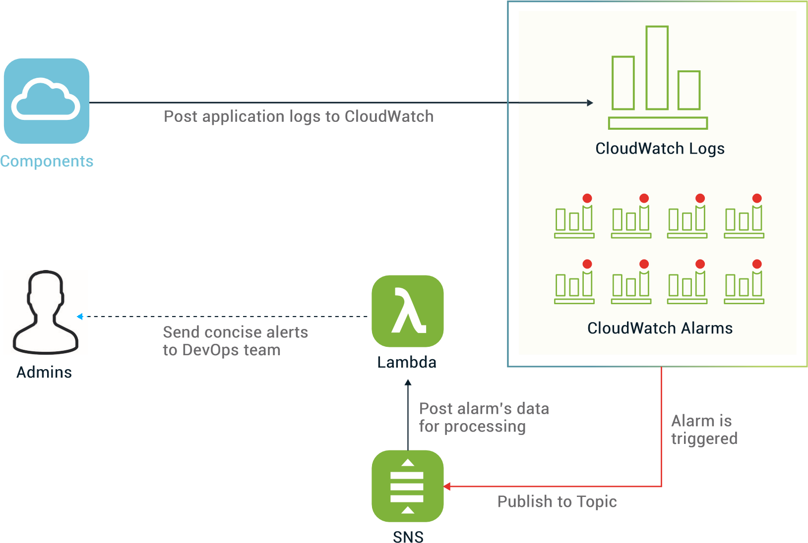

[title]: # (Architecture)
[tags]: # (thycotic access control)
[priority]: # (20)
# Access Controller: The AWS Architecture

## AWS Deployment Network Layout

## Breaking Down the Access Controller’s Services

Access Controller is a collection of micro-services that interact together. Some are deployed on isolated hosts and some are clustered together. There are four (4) clusters of services:

1. the panel services that consist of

   * the admin dashboard
   * the API
   * LDIFizer
1. the proxy services that consist of

   * the SSH piper
   * the RDP proxy
1. the router service
1. the Vault’s [1] secrets management service

Each service is independently configured, deployed and managed. However, services that belong to the same cluster are deployed to the same hosts, thus must scale together.

## Topology In AWS

In this section, we will describe the AWS components that are used to host each cluster of services and how they are interconnected. All the various components are deployed within a Virtual Private Cloud (VPC). The VPC is split into three subnets, each one in a different Availability Zone.

### Panel Services

This is the most complex cluster of services in Access Controller. The diagram shows an overview of its topology.

* **Load Balancer** - The single internet-facing component is an Elastic Load Balancer (ELB). The main role of the ELB is to automatically distribute incoming traffic to an Auto Scaling Group of EC2 instances that host the panel services. Additionally, it handles the HTTPS encryption & decryption process (SSL termination).
* **Auto Scaling Group** - The aforementioned Auto Scaling Group (ASG) consists of a pool of identical EC2 instances that are deployed across the three Availability Zones. The services running on those instances are thus protected from failures in a single location. There will always be at least one host available to handle requests in another Availability Zone. Unhealthy hosts are automatically detected and replaced so that the services are getting the computing capacity we want.
* **RDS** - The panel services require access to MySQL databases. Since they are distributed over an ASG, all the hosts need to access the same data. Amazon offers a managed relational database service (RDS) that supports the MySQL engine and can be used as an external re-source. The Multi-AZ deployment feature is enabled. The RDS automatically replicates the data in a synchronous manner to a standby instance in another Availability Zone. In case the primary instance becomes unhealthy, RDS will failover to the slave one without changing the endpoint, so the whole process is transparent to the application.
* **EFS** - A subset of the application data stored by the admin dashboard are either very hard to insert into a database or the performance overhead of storing them in object storage is too large. Our solution was to use a distributed file system so that they are shared between all the hosts. Amazon’s Elastic File System (EFS) is a file storage where data are stored redundantly across multiple Availability Zones and supports concurrent access from multiple EC2 instances.
* **SQS** - The admin dashboard regularly defers the processing of time consuming tasks by submit-ting them to a queue. An idle worker can then accept the task and process it. Even distribution of labour across all workers requires all the hosts to connect to the same queue. We achieved it by using Amazon’s Simple Queue Service (SQS). It is a scalable, fully managed message queuing service that works out of the box with our application framework.
* **ElastiCache** - Caching is enabled on the Admin Dashboard’s php framework. In order for the cache to be consistent for all the cluster, we use Amazon’s ElastiCache web service.
* **S3** - The SSH piper service can store session log files in object storage that are later accessed by the Admin Dashboard. Amazon’s S3 service provides with the flexibility to grow and shrink our storage on demand. An S3 resource, or “bucket”, is used to store the generated data. The admin dashboard has read-only access to the bucket, so the admin cannot modify the logs in any way.
* **Other Components** - There are also some other components involved that have to
do with log keeping and monitoring. We will discuss them in under Monitoring for the whole cluster of services.

### Proxy Services

Most of the application’s workload is generated by the proxy services. The following diagram
shows an overview of their topology.

* **Load Balancer** - The single internet-facing component is again an Elastic Load Balancer (ELB). Its function is similar to the ELB of the panel services. The main difference is that this ELB accepts SSL connections (SSH & RDP) instead of HTTP/HTTPS.
* **Auto Scaling Group** - The services run on EC2 instances that belong to an ASG. Like the panel services, the instances span across different AZs. Automatic Scaling policies have also been created.
* **RDS** - The SSH proxy keeps the user keys in a database. An RDS is used for to host this database making the keys accessible to all the running EC2 instances. Moreover, Multi-AZ deployment is enable in the RDS as well as the more critical feature of data encryption. This is required due to the sensitive nature of the user keys.
* **S3** - As we mentioned in Section 3.2, the SSH proxy can generate session log files and will store them in an S3 bucket. To that end, the service has write access to that bucket.

### Router Service & Vault

The architecture of the Router Service and the Vault is relatively trivial, so there is no added value from a blueprint. They both consist of a Load Balancer that distributes the traffic to a pool of EC2 instances.

## Monitoring

A lot of thought has been put into the monitoring plan of the infrastructure and application components of Access Controller. The definite goal is to identify and easily debug any single or multi-point failures. The following shows an overview of the monitoring scheme.

All the application logs are kept centrally in CloudWatch, Amazon’s monitoring service. A wide variety of alarms has been established that automatically look for failures in the logs. In addition, other sets of alarms monitor the AWS resources that the application uses.

In case an alarm is triggered, then a notification is sent to a designated notification topic. The payload is then posted to a Lambda function that parses it for a first level of screening and classification of the event. Finally, a notification is sent to the DevOps team with the necessary info to handle the incident.

## Reference

1. Vault by Hashicorp. https://www.vaultproject.io/.
