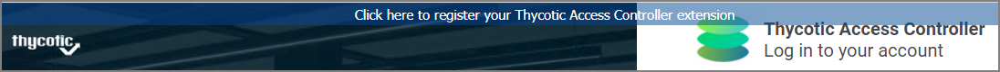
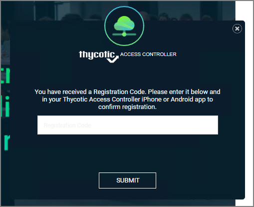
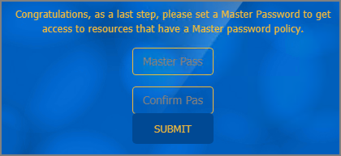
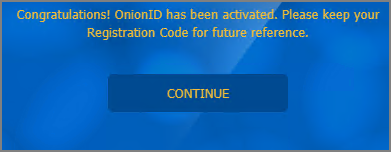

[title]: # (Browser Extensions)
[tags]: # (thycotic access control)
[priority]: # (2)
# Browser Extensions

After installing the Thycotic Access Controller extension from the browser store, you will see a banner in your browser to register your extension.

1. Click the __here__ link in the message banner.
1. The Registration modal opens, prompting for the Registration Code that has been emailed to you for your account.

   

   This code has been provided via email and should be used for the registration of your browser and your mobile device.

   

   Enter the registration code and click __Submit__.
1. You are prompted to create a __Master Password__, enter a master password of your choosing and confirm.

   

   Click __Submit__.
1. On the congratulations to your account activation modal, click __Continue__.

   

After your account activation and successful registration via the browser extension, you receive one more email prompting you to register your mobile device.

Continue with [Mobile Device Registration](mobile.md)
