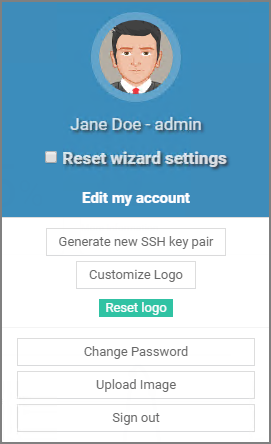

[title]: # (Activation)
[tags]: # (thycotic access control)
[priority]: # (1)
# Activation

Either after setup of your organization by the Thycotic team on the SaaS Thycotic Access Controller or the completion of the Thycotic Access Controller on-premises installation, you (the administrator) will receive an email with credentials (username & password) to login into your admin account. You will also receive a link for activating your newly created account. The email arrives from __Thycotic Cloud Access Support__.

The link in the registration email, directs you to the __Thycotic Access Controller__ login page.

## User Avatar

You can access your account details and avatar settings via the user name link on the top right corner of the screen.

## Setting new Password

You must set a new password for your account. When the new password is set, you will automatically be logged in and redirected to your dashboard. Use the dashboard to setup and manage the Thycotic Access Controller for your organization.

## Home Dashboard

After you are logged in, the home dashboard opens. Showing default statistics for your portal.

