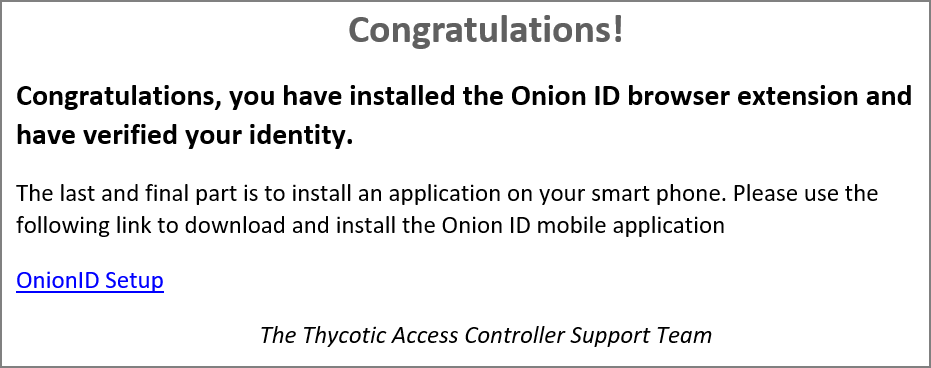
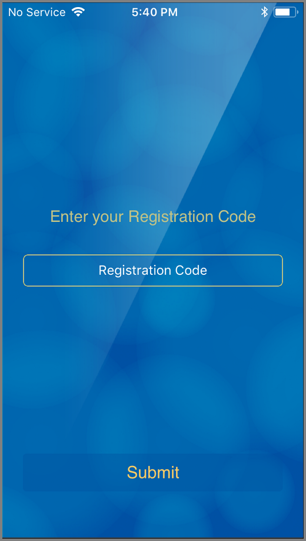
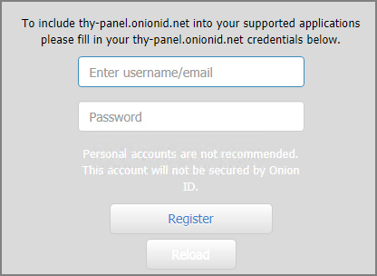
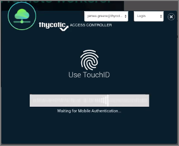
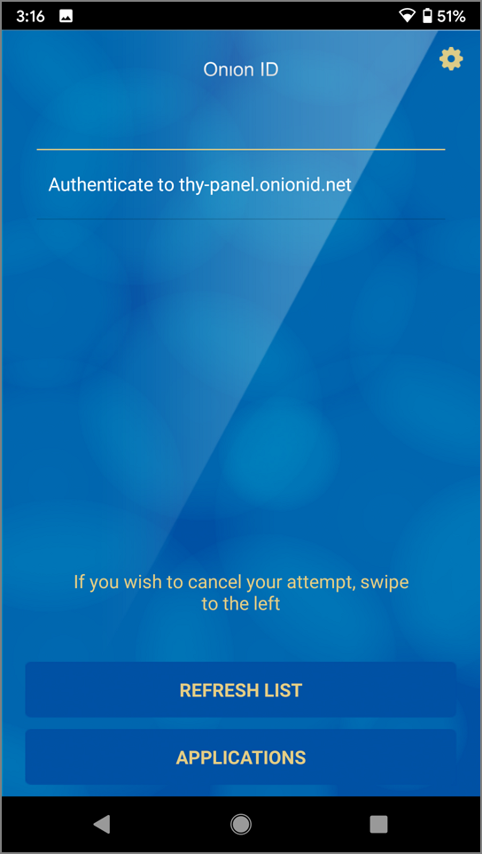
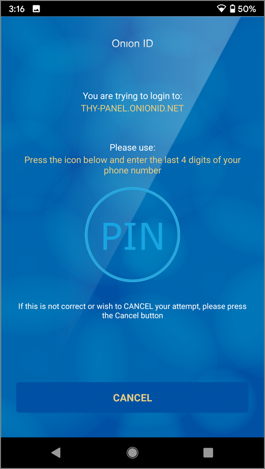
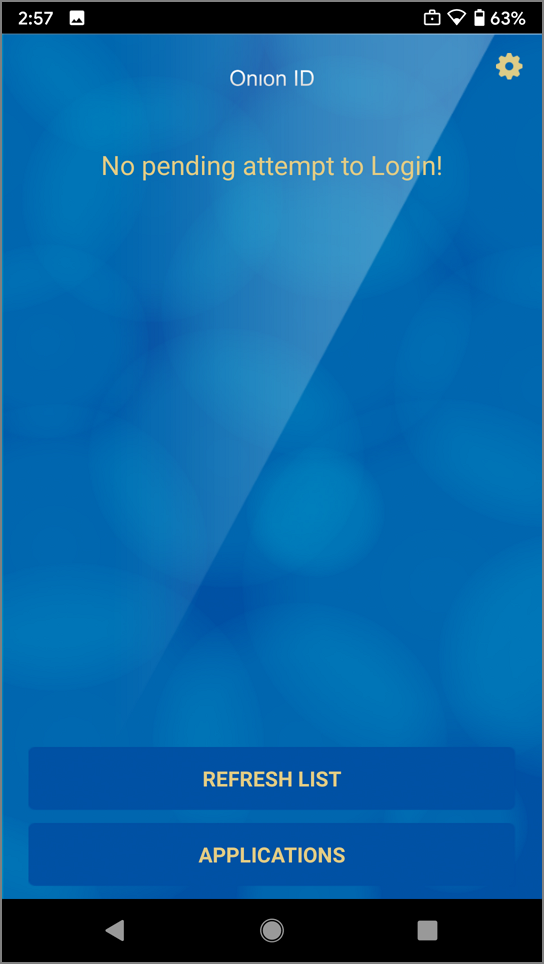
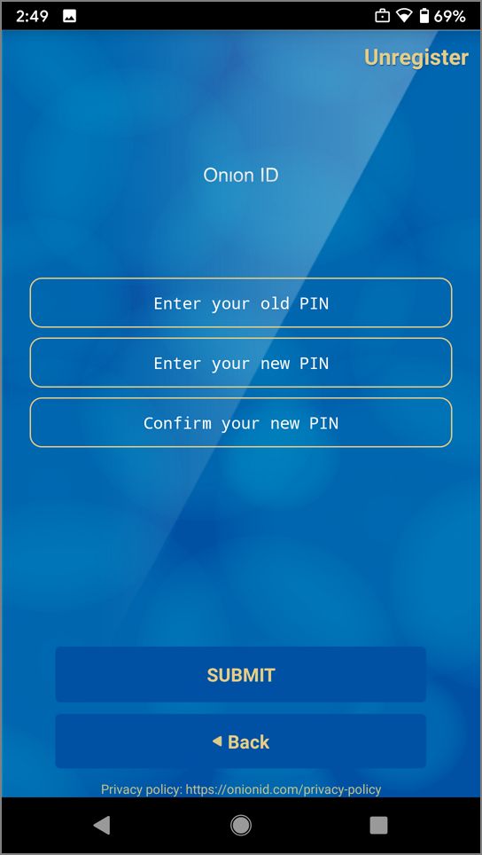

[title]: # (Mobile Registration)
[tags]: # (registration)
[priority]: # (3)
# Mobile Device Registration

After a successful [Browser Extension](be.md) installation and registration, follow the link in your registration email, to download the OnionID (Thycotic Access Controller) Application.

After installing the OnionID (Thycotic Access Controller) Application from your devices app store, follow these registration steps:

1. Open the newly installed mobile application.
1. The application prompts you for a registration code:

   

   Use the registration code that was emailed and that you also used in the browser extension registration.

   Click __Submit__.
1. The application prompts to set up a PIN in case TouchID/Fingerprint isn't available or won't work.

   

   Enter a 4-digit PIN and Click __Ok__.
1. Back at your computer, if you are currently logged into the panel, logout and reload the login page. Users that have not accessed the panel, open the login URL.
1. In the register modal, provide your user email and password, click __Register__.

   

You mobile device is now registered and ready to be used for subsequent logins.

## Using Mobile Authentication

After you successfully registered your user account the your mobile device app, every login into the access controller panel will now authenticate via your mobile app.

1. Navigate to the Access Controller URL and open the panel login page.

   

   The pending authentication modal opens up:

   
1. On your mobile device, open the OnionID application. The app displays a pending login attempt:

   
1. Click __Authenticate to...__.
1. Either use your Fingerprint or a PIN to authenticate the login. In this example we use a PIN.

   

   Click __PIN__ and enter your authentication pin, click __Submit__.

   On your computer, the panel application opens to the home page.

## Mobile App Settings

In the mobile app you can change the PIN and unregister the mobile device from the panel application. 

1. Navigate to the mobile app settings via gear on the main mobile app screen.

   

   Click the __gear__ in the upper right corner.
1. You can now change your authentication PIN or Unregister the app:

   

