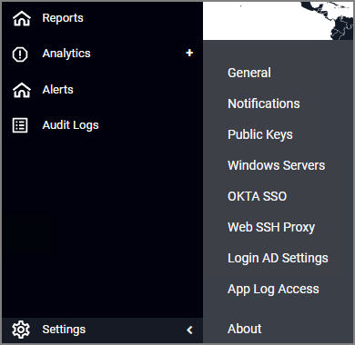

[title]: # (User Interface)
[tags]: # (thycotic access control)
[priority]: # (1)
[display]: # (none)
# UI Reference

## Left Navigation

The left navigation menu depends on your license terms. A customer with license to all Thycotic Access Controllers might see the following:

### Navigation Tree

Clicking the parent items expands the navigation tree:

### Collapsed Menu

The navigation menu can be collapsed via toggle:

## Settings Menu

The Settings Menu can be accessed via the Settings gear at the left bottom area of the navigation menu.

