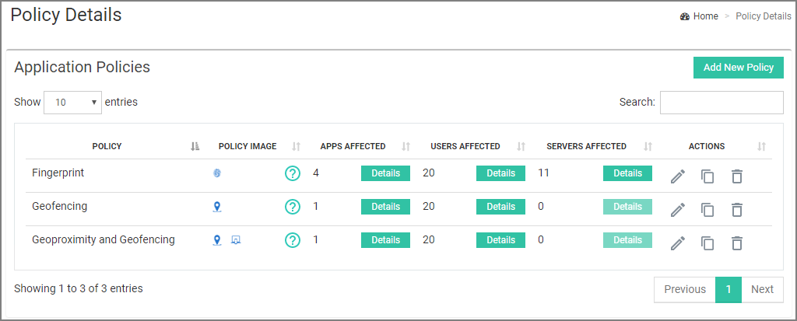
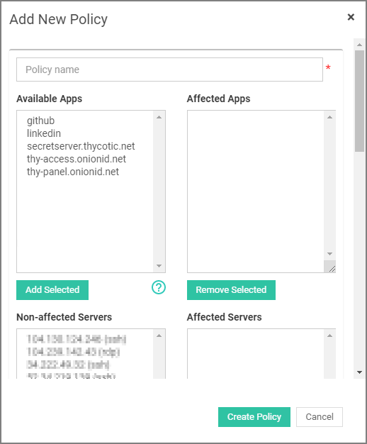
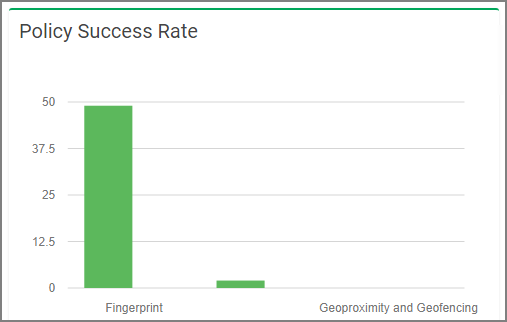
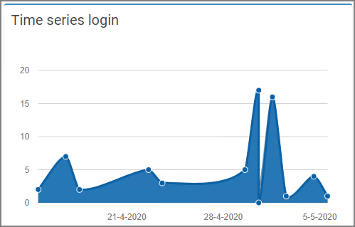

[title]: # (Policies)
[tags]: # (thycotic access control)
[priority]: # (4)
# Policies

## Application Policies - General Policy

Thycotic Access Control supports 6 (six) authentication methods:

* Fingerprint (TouchID): Authenticates users by their fingerprint (applies only to iPhones 5S and later).
* AirShake: Establishes the presence of the user by requiring users to shake their phone.
* Geofencing: Validates that users are within a predefined geological area.
* Geoproximity & Geofencing: Uses the location of the phone to verify that users are next to their computer.
* MasterPass: Requires that users provide a password to their browser extension.
* YubiKey: A YubiKey is a small USB device that offers 2FA by generating one-time passwords.

A Policy consists of the following:

* Affected Apps and Servers - List of apps and servers that have this policy enabled
* An Authentication Technique - Combination of up to 3 (three) authentication methods
* Supporting Browsers and Operating Systems
* Include IPs - Onion ID Authentication will be available only from these IPs  
* Exclude IPs - Onion ID Authentication will be forbidden from these IPs

The table lists every available policy that can be assigned to an application, refer to [Set Policy for Application](../applications/cfg.md#set_policy_for_application).

Under __Policy image__, displayed icons help you identify the authentication method(s) required by this policy.  
By clicking __Details__ assigned to each policy under the Apps, Users, or Servers Affected columns, you are able to take a quick look at every application, user or server that is affected by this policy at the moment.

### Create an Application Policy

Every organization has default policies available, Fingerprint (TouchID), Geofencing, and Geoproximity & Geofencing.

You are able to create new policies.

1. Click on __Add New Policy__ located in the top right corner of the main panel.

   
1. On the __Add new policy__ modal,

   * enter the new policy name, and
   * select (optionally) any application or server that will be affected by this policy. You can leave these two fields blank and set the application policy later from the applications’ configuration panel, refer to [Set Policy for Application](../applications/cfg.md#set_policy_for_application).

>**Note**: It is mandatory to set an Authentication Technique for the new policy. As described above, Authentication Technique is a combination of up to 3 different authentication methods, so click on the dropdown menus to select the desired methods for this policy.

Use the scroll bar to scroll through the whole __Add New Policy__ modal and set any other configurations you may require.

### Enable Fallback to Master Password

Enabling fallback means that when an employee cannot use their phone to prove their identity and satisfy the policy requirements, Onion ID will provide the employee with an option to enter a master password. The employee sets up this master password during the initial registration process. The employee can change it at any time to a different value.

### Enable Auto-login for Specific IP Addresses

Auto-login helps an IT administrator to allow direct logging into corporate applications and servers from trusted IP locations.

If a user tries to connect to an application from a different IP, Thycotic will use an extra authentication mechanism to verify the person requesting to login. As an example if you have enabled auto-login with a policy that has Geofencing and Touch ID (fingerprint) as authentication methods, then if the users try to login to an application from an IP not listed in the IP list, the users will be verified by their location (Geofencing) and their fingerprint (Touch ID). In contrast the 'Included IP' list (lower in the page) allows login only from the specific IPs in the list.

Feel free to set Browsers, Operating Systems and  include/exclude IPs fields according to your needs.
Finally, click __Create Policy__ for you settings to take effect.

## Policy Success Rate

The chart shown in Figure 3.3 helps you monitor the most popular policies and provides detailed statistics regarding the amount of successful and failed attempts for each policy. You can then modify your policies according to your users feedback.

## Time Series Login

The chart shown helps you monitor the amount of daily performed login attempts per authentication method.

