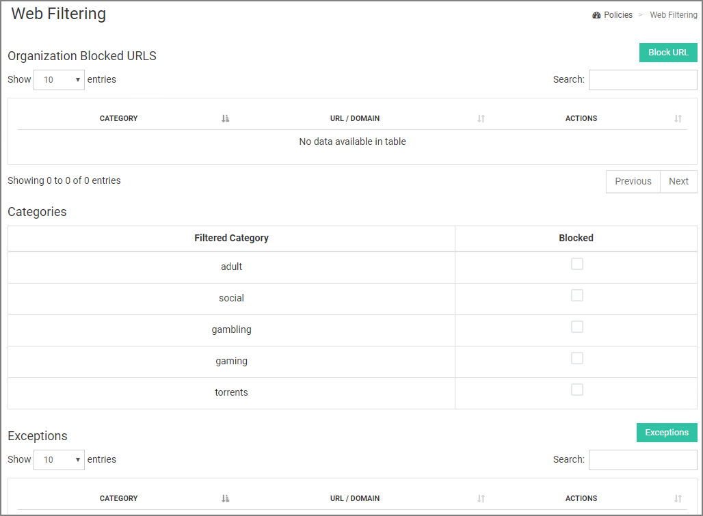
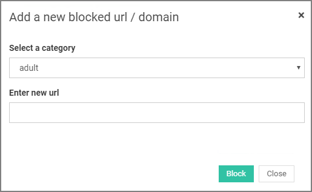
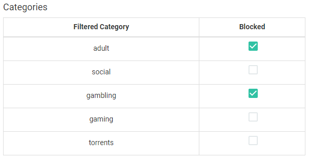

[title]: # (Web Filtering)
[tags]: # (thycotic access control)
[priority]: # (4)
# Web Filtering

With the Thycotic Access Controller you have the power to block your organization's users from accessing categories of unwanted websites. The default categories are: adult, social, gambling, gaming and torrents.

Access Controller can extend the list of blocked websites by adding URLs or enabling sites already included in the default list.

## Add Organization Blocked URLs

To extend the list of blocked URLs:

1. Click __Block URL__ in the top right-hand side of the main panel to bring up the __Add a new blocked URL/domain modal.

   
1. Use the __Select a category__ drop-down menu to choose a category for the URL.
1. Under __Enter new URL__, add the URL to be blocked.
1. Click __Block__ to finish adding the URL.

The new URL is now displayed in the blocked URLs table at the top of the main panel. Click __Remove__ to delete any URL that no longer needs to be blocked.

## Enable/Disable Blocked Categories

The __Categories__ list shows all available filtered categories. Check the box next to each category to block the websites in that category.

### Add Organization Exception URL

To remove a website from the list of default blocked URLs, Click on __Exceptions__ on the bottom right corner of the main panel. Select the filtered category that the desired URL belongs to.
<!--
 -->

 Choose the desired URL from the list and click __Add Exception__ to save your changes.

The newly allowed URL will be displayed in the table at the bottom of the main panel. Click __Remove__ to remove the exception.
