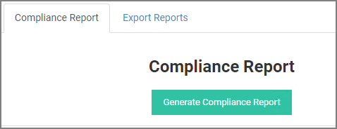

[title]: # (Compliance)
[tags]: # (reports)
[priority]: # (9)
# Compliance Reports

You are able to create an extended report regarding web applications, servers and users of your organization that will contain data needed for you to have a complete and detailed overview.

## Web Application Overview

For each organization app, check if it is secured by policy, if password reset is available and if usage tracking is enabled. All authentication techniques that are available for this app are displayed as well.

## Server Overview

For every provisioned server you can view information regarding its policy security and if key rotation and session recording are available. Authentication techniques used for logging to those servers are also been listed. 

## User Overview

For every organization user, you can keep track of the applications and servers he has access to. In addition, check if there is a policy security and whether or not authentication logs and contact info are enabled and available respectively. 
