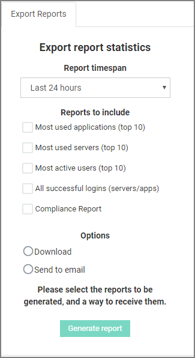

[title]: # (Export)
[tags]: # (reports)
[priority]: # (10)
# Export

Every available report can be exported by either downloading or sending to an email. Check on the box of the report(s) you wish to export, select the way to receive it and then click __Generate Report__ button at the bottom of the page.

