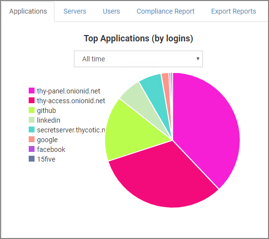
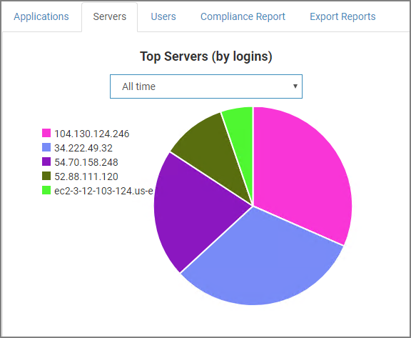
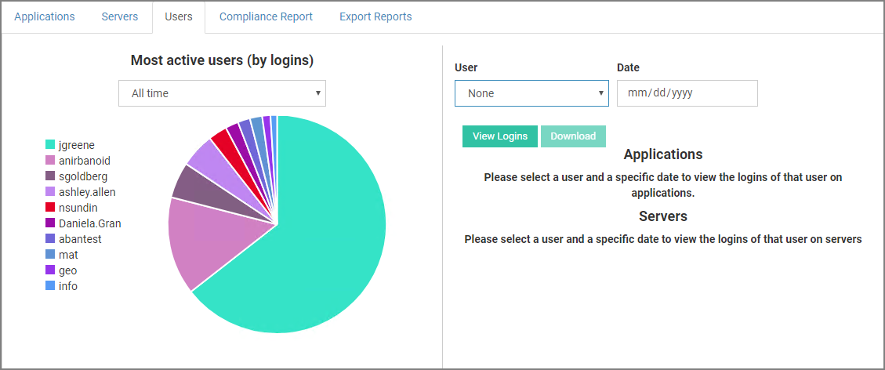

[title]: # (Reports)
[tags]: # (thycotic access control)
[priority]: # (8)
# Reports

The __Report Panel__ is where application usage, server and users analytics are displayed.

Under __Active notifications__ you can view every login attempt that is being performed by organization users in real time (Figure 7.1). You are being informed about the status of the login attempt, the user performing this action and in which server as well as the Policy he is using to login. You can also prevent the user from logging in by clicking the button at the far right column.

  
## Charts

### Top Applications by Logins

This top applications and users by login pie chart illustrates top 10 applications in user logins in the given period of time. Point to a piece of the pie chart to view the exact amount of logins that have occurred for an app.

### Top Application Users by Logins

Select an application from the dropdown menu and you will be presented with a relationship chart that illustrates the amount of logins performed by each user.

### Top Servers by Logins

This pie chart illustrates top servers in login attempts in the given period of time. Point to a piece of the pie chart to view the exact amount of logins that have occurred for a server. 

### Top Server Users by Logins

Select a server from the dropdown menu and you will be presented with a relationship chart that illustrates the amount of logins performed by users.

### Most Active Users by Logins

This __Most active users by logins__ pie chart illustrates top 10 users with the most performed logins in the given period of time. Point to a piece of the pie chart to view the exact amount of logins that have occurred by a user.

Select a user from the dropdown menu and specify the date to look for any application or server logins performed by this user.

### Login and Failure

This column chart illustrates the amount of successful and failed logins that occur every month. 

### Time Series Login

This chart illustrates the amount of logins over time for all tracked applications. To add statistics about another app, click on the __Track another app__ button.

