[title]: # (Users & Groups)
[tags]: # (thycotic access control)
[priority]: # (6)
# Servers

## Manage Servers

### View Server Information

The Server information table contains details regarding organization provisioned servers. Besides some information such as server’s hostname, IP address, Proxy hostname etc, there is information about the operating system that server runs, the cluster of servers it belongs to (only for Linux servers) and the number of users that are able to login to it.

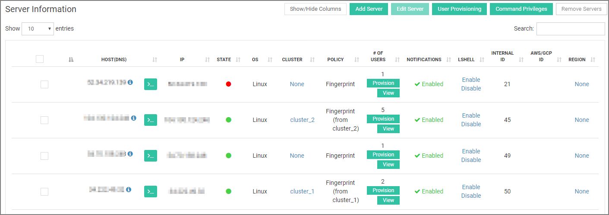

Next to a server’s hostname there are button for either Linux or Windows servers.

In the first case, click on the blue button to display instructions for how to connect to server via SSH.

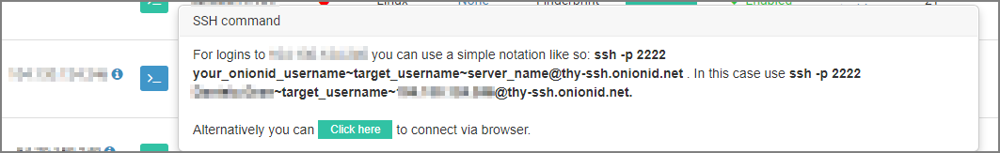
  
Clicking on the a Windows server, you will be redirected to a new browser tab that opens a guacamole connection to the server.

  
#### Define cluster for a Linux Server

A Linux server is possible to belong to a group of servers that have a common policy. Under the __Cluster__ column, click on the cluster name to change the cluster it belongs to.

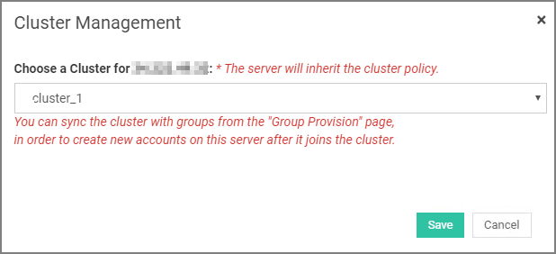

If the name __None__ is displayed instead, click on it and either select a cluster for the server or one of the available policies from the second drop down menu (Figure 5.5b).

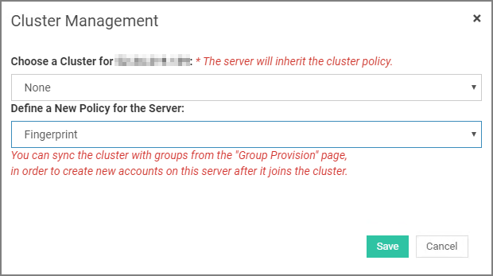

#### View User Access for a Server

If you wish to view the users that have access to a server, click on the __View__ button under __# of users__ column. In the displayed popup window (Figure 5.6), you will see every user that is able to login to the server over SSH or RDP.

#### Enable/Disable Server Notifications

Click __Enabled__ or __Disabled__ under the __Notifications__ column in order to disable or enable notifications and alerts to be sent to the administrator when critical changes are taking place on the server.

### Add Server

If you wish to add a new server, click on the __Add Server__ button on the top of the main panel. In the pop-up window that comes up, you have to enter information regarding the server you are adding.

#### Windows Server

For a Windows server, enter its hostname or its static IP, the RDP port if needed and the domain name that might have been set up.

Select __Use already registered account credentials__ option if the server you are adding uses already stored credentials, which you used in the past for other servers. Choose the server with the same credentials from the dropdown menu that appears below.

Select __Register new account credentials__ option to enter credentials for the new server. Root credentials are required for remote account management (privileges, keys) and system configuration. It is a very common practice if you are also using tools like Chef, Puppet, Ansible etc.

#### Linux Server

For a Linux server, enter its hostname or its static IP and the SSH port if needed. If there is an LDAP service running on your server, choose __Yes__ to the corresponding dropdown menu. If you wish your server to belong to a cluster, click on the respective drop down menu and select the desired cluster.

In the Policy field, select the authentication method you wish to set for your server. This is a required option.
Select __Use already registered account credentials__ option if the server you are adding uses already stored credentials, which you used in the past for other servers. Choose the server with the same credentials from the dropdown menu that appears below.

Select __Register new account credentials__ option to enter credentials for the new server. Root credentials are required for remote account management (privileges, keys) and system configuration for Onion ID. It is a very common practice if you are also using tools like Chef, Puppet, Ansible etc.

Select __Enable script execution control__ to give users a limited shell where they can only run scripts via the script checker. If banned commands are detected in the script, execution is aborted and the admin is notified.

>**Caution**: If a cluster is chosen and has a defined policy, then it will apply to the new server. If the cluster policy is not defined, this policy will apply for all the servers in the cluster.

Remember to click __Save__ for changes to take effect.

### Provision Users

Requirements: You need to have available servers before provisioning a user. See Add Server section for more info.

If you wish to allow users to have access to a specific server click on the __Provision Users__ button at the top of the main panel. Select the desired server from the list shown in the popup window that comes up. This list displays all available Windows and Linux servers that have already been provisioned through Onion ID panel.

#### Windows Server

Select the desired Windows server from the list and click on the __GO__ button.

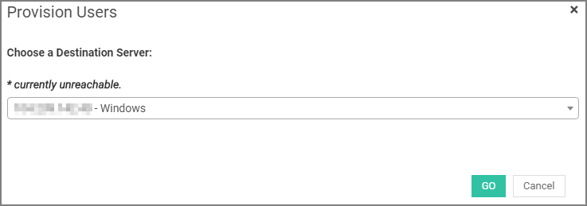

A list of all server accounts will be displayed.

Now click on the account that you wish to provision. Finally, select the users who are going to have access to the server using this account.

Click on the __Submit__ button at the bottom of the page for the provision to complete.

#### Linux Server

Select the desired Linux server from the list and click on the __GO__ button.  

In the next step, you are able to manage the server accounts and provide sudo access if needed.

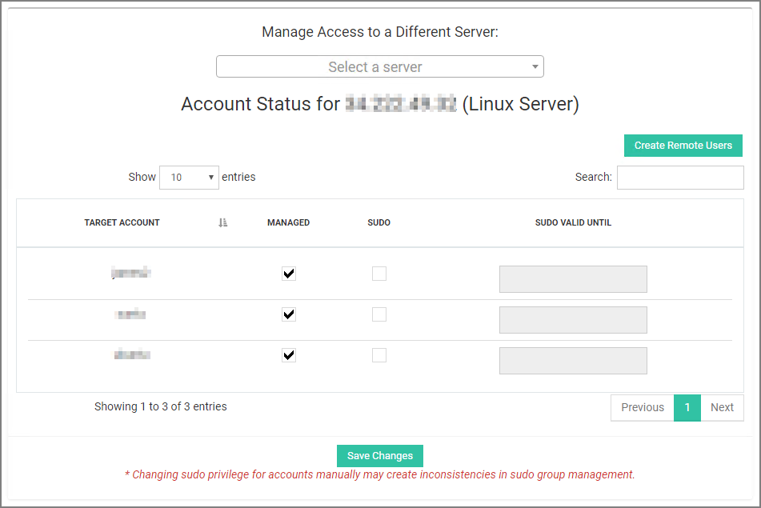

On the table below, assign the available accounts to the users you wish to gain server access (Figure 5.14). You can also set a date until an account will be available for a user in the __Valid until__ field. Leave this field blank otherwise. Click __Confirm__ at the bottom of the page for the provision to complete.

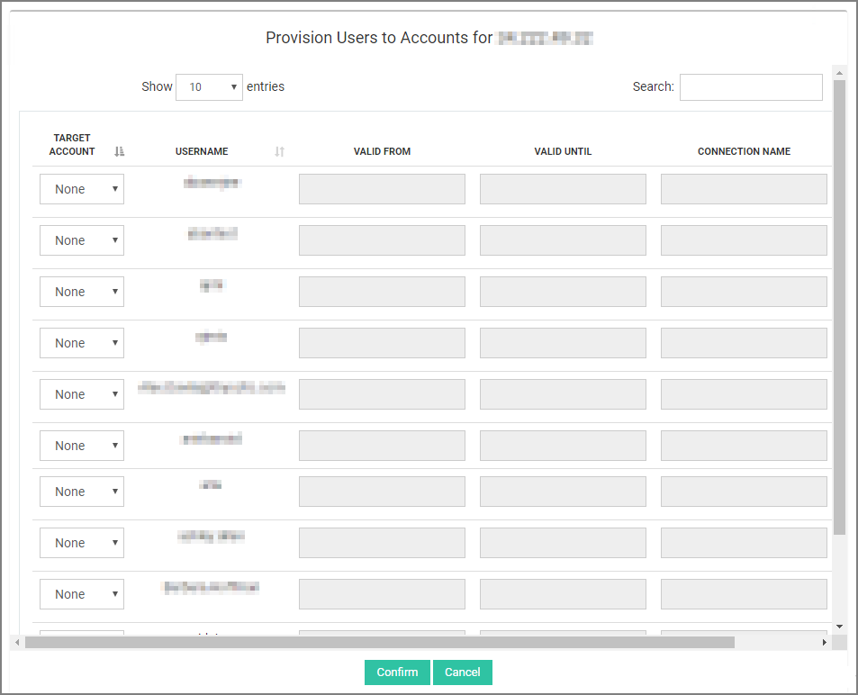

>**Caution**: Giving 'sudo' rights to accounts can compromise the system's security & stability. When you choose to unmanage accounts, then provisioning for those accounts will be lost. If you choose to manage them back sometime later, you will have to re-define the user provisions again.

After provisioning, the user will receive an email which will inform him about the SSH access he has been granted in addition with a link in order to upload a public key in OpenSSH format. Then he will be able to login to the server using the provisioned accounts.

### Set/Manage Command Privileges

You are able to apply another layer of security by filtering the commands a user can run on your servers. 

Click on the __Command Privileges__ button at the top of the main panel and on the popup window that comes up define the commands you wish to block or receive a warning message when a user has attempted to run it (Figure 5.16).

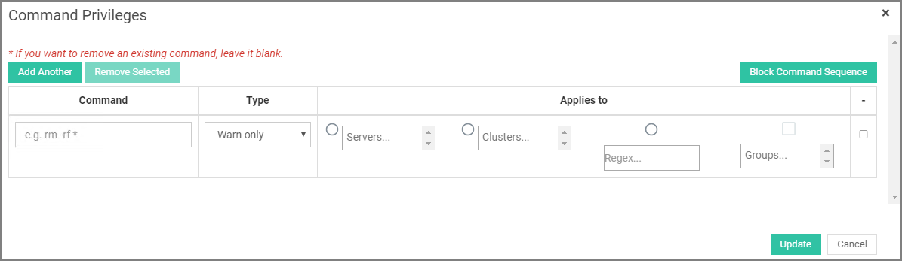

Type the desired command in the __Command__ field and select either __Warn only__ or __Block__ according the level of security you wish to apply. Then, you have to choose between a single server, a cluster of servers (Linux only) or a regular expression in which the rule will be applied. Enter as many rules as you wish by clicking the __Add another__ button or delete a rule by first selecting the desired rule(s) and then clicking the __Remove selected__ button. Remember to click on the __Update__ button for changes to take effect.

### Manage Clusters

Click on the __Manage clusters__ button at the top right corner of the main panel to add a new cluster of servers (group of Linux servers) or manage the existing ones.

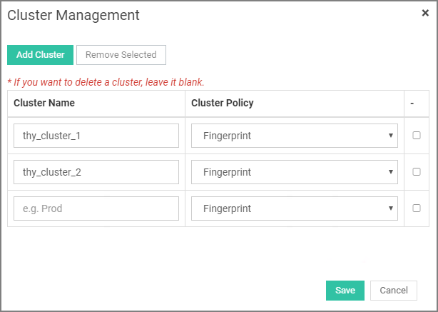

In the displayed popup window, under __Cluster name__ column, enter or edit the name you wish for the cluster. Then select the applied policy for this cluster from the drop-down menu in the adjacent column. Remember to click __Save__ for changes to take effect. If you wish to delete a cluster you can either leave it blank or check the box on the far right column and click the __Remove selected__ button.

### Remove Server

If you wish to remove a provisioned server(s), check on the corresponding box(es) on the far left column of the __Server Information__ table and then click on the __Remove server__ button at the top right corner of the main panel.

### View Users’ Data

### Linux Servers

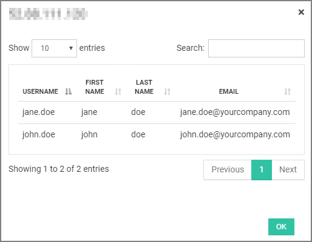

The table shown, displays provisioned users including details regarding their recent activity on the allowed servers.

* Under __User__ column, click on a   button to view information about the SSH command required to login to a server using the respective account user name.
* Under __# of allowed servers__ column there is a __View__ button for each account user name. By clicking on it you can view all the servers that this user has access to.  
* Under __Last month’s accessed servers__, click on the __View__ button to view the servers that have been accessed by the user the past month.
* In the far right column, you can view the timestamp from the last SSH key refresh performed by SSH Piper. You can set this SSH key refresh interval in either 30 or 60 days.

#### Deprovision User

To deprovision a user from a server, click on the __deprovision__ red button. From the popup window that comes up, select one of the servers that user has access to and then check the box next to the account you wish to revoke. Finally, click __Deprovision__ for changes to take effect.

#### View/Replay Command History

Next to each user account name, click on the   button to view user’s recorded sessions. Select one of the servers that user has access to and wait for the available sessions to load. From the list below, click the download button to download the log file that contains the command history for this particular session.

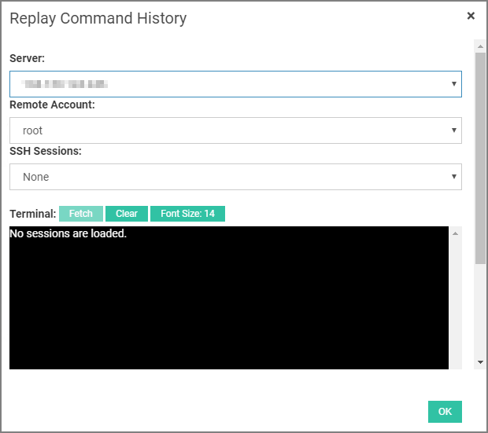

Click on the play button to replay the command history of a session on the browser. Select one of the server that user has access to and then choose one of the available sessions in the drop-down menu below.. Click __Fetch__ button for the replay to begin. When the command history replay has ended, you can click on the __Find sessions...__ button above the terminal to select another session to play.

#### Create Remote Users

If you wish to create a new SSH account for remote login, click on the __Create remote users__ button at the top right corner of the __Users’ Data__ section. Select the server you want to create the account to and enter the account name below. Finally click __Create__ at the bottom.

#### Windows Servers

Users’ Data table displays the users that have access to a Windows server and the account they use to login through RDP. 
Click on the __Add RDP Accounts__ to add a new remote account for a specified server. First select the desired server and then enter credentials for the new account. Click __Add__ for changes to take effect.
  
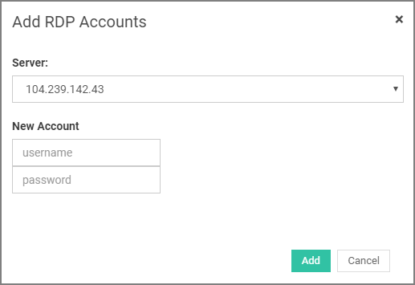
