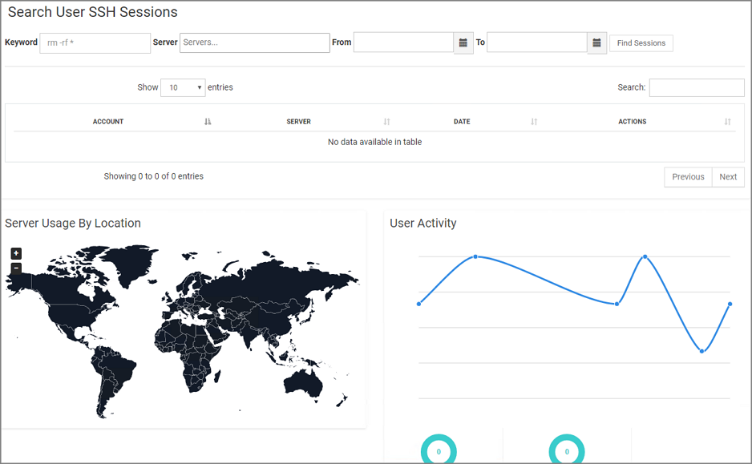
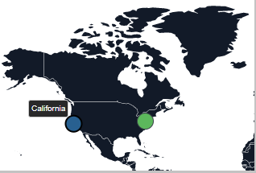
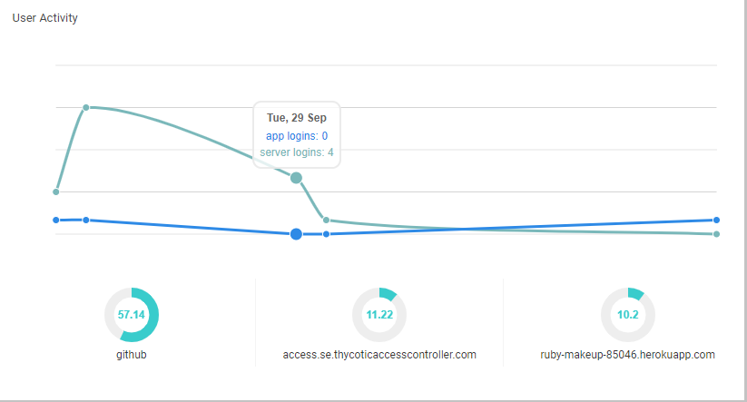
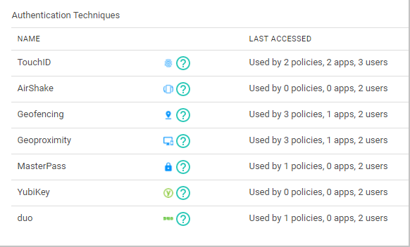

[title]: # (Statistics)
[tags]: # (thycotic access control)
[priority]: # (7)
# Statistics

## Search User SSH Sessions

You can monitor the SSH commands runned by users for a given time by following the steps below.

1. Enter the command you wish to search for inside  the __keyword__ field (i.e sudo or rm -rf).
2. Select one or more servers listed under __Server__ field to look for the specified keyword.
3. Set the __From__ and __To__ fields to specify the time period of the search.
4. Click __Find Sessions__ button.

In the table, you are able to view the accounts that run the specified command, the server (if there were more than one) this command run to and when did it happen.  
From the far right column, click on the __Download__ or __Replay__ buttons to download the command history log file or replay it in the browser respectively.

## View Server Usage
<!--
 -->

In the map shown above, you can spot the location of the provisioned servers used by the organization.

## View User Activity
<!--
 -->

The chart shown illustrates users’ logins in a period of time. By pointing on every dot you can view the number of server logins that performed on a specific day. Click on the link below the date to view details regarding the users that logged in.
<!--
 -->
