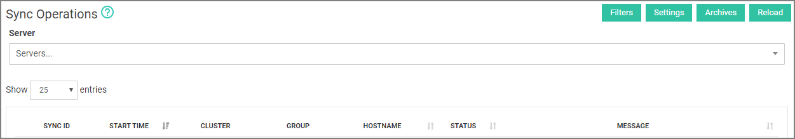

[title]: # (Sync Reporting)
[tags]: # (thycotic access control,servers)
[priority]: # (7)
# Sync Reporting

Sync reporting shows synchronization data for servers. User can use filters to customize the display data by Cluster, Groupd, Status, and/or Start Date.

