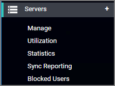
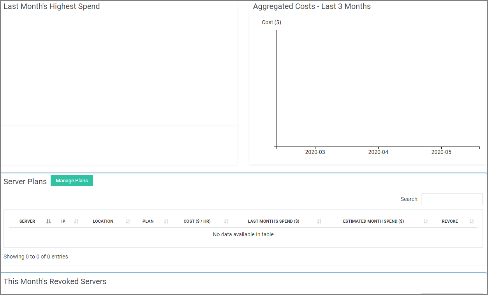
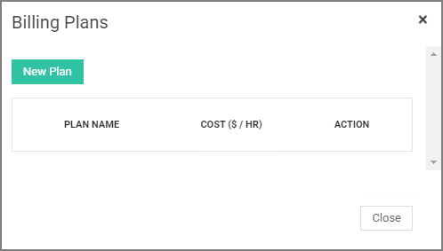
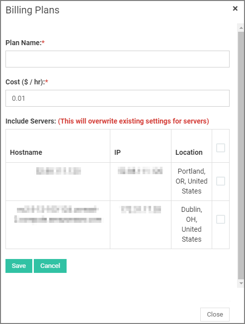

[title]: # (Utilization)
[tags]: # (thycotic access control,servers)
[priority]: # (6)
# Utilization

In this section you can monitor the financial information regarding your provisioned servers in case they are part of a package from a hosting provider. This service is more suited for the CFO of a company.

Navigate to __Server | Utilization__ to open the server utilization pages:

Click __Manage Plan__, then __New Plan__.

You can create a server plan(s) based on financial data provided by the hosting company and monitor the cost of your infrastructure.

You can create as many billing plans as you wish and keep track of them under __Server Plans__ subsection. A billing plan for a server can possibly change, so in order to update your data click on server’s name or IP under __Server__ column and select the new plan you want to assign to the server.
<!--
 -->

When you no longer need to monitor a server, click on the __Revoke Server__ button on the far right column. It will then be listed under __This month’s revoked servers__ subsection.
<!-- 
 -->
  
When enough data will have been collected, you will be able to have a better view of your financial report through __Aggregated Costs__ and __Last month’s highest spend__ charts.
