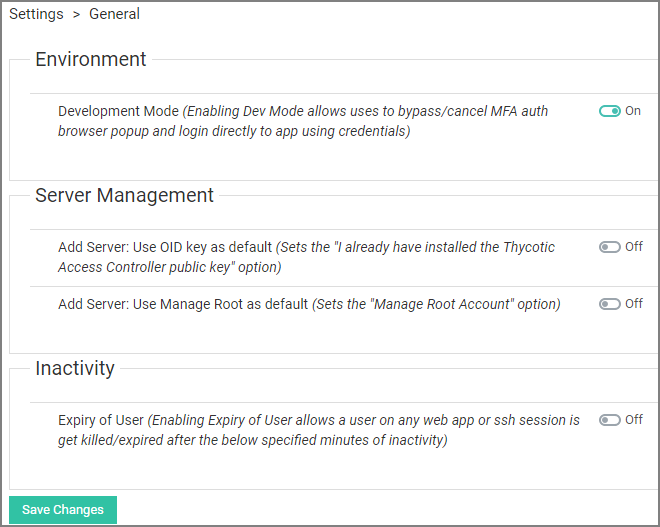
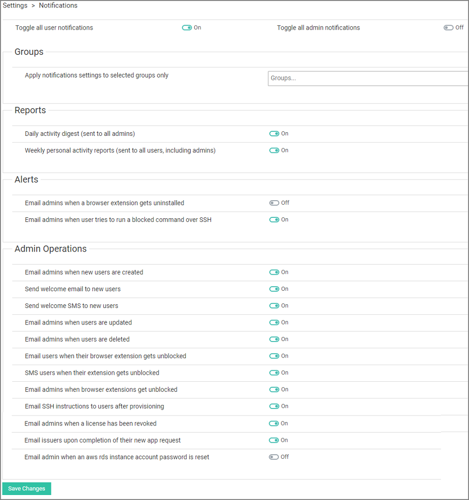

[title]: # (Settings)
[tags]: # (thycotic access control)
[priority]: # (11)
# Settings

The Settings menu is accessible via the gear icon on the bottom of the left navigation frame.

## General

The General menu allows settings like developer mode, server management, etc. to be enabled or disabled.

## Notifications

Use __Notifications__ panel to enable or disable notifications sent when certain actions are taking place in either Onion ID panel or BE by organization users.
Notifications are divided in 3 categories based on their type. Reports, Alerts and Admin Operations.
You can either enable/disable notifications that refer to users or admins globally from the main two switches at the top of the panel or set the state of each notification switch next to its description separately.

### Reports

The Access Controller can sent an email with a daily digest report to every admin regarding login statistics and usage of resources.

All users, including admins, can also receive a weekly report regarding personal activity. Set those switches to __On__ if you wish to receive report notifications.

### Alerts

Enable these notifications if you wish to receive an email every time someone uninstalls a BE or tries to run a blocked command over SSH.

### Admin Operations

Notifications listed under this subsection have to do with actions performed by admins such as update user or unblock BE. This is helpful when you want to keep track of important procedures that happen in the panel in a multi-admin organization.

## Public Keys

The Public Keys page lets admins enter new public key details. User Public Keys can be viewed and managed.

## Windows Servers

Under Windows Servers the password rotation interval for Windows Server accounts can be set. Windows Server accounts can also be viewed.

## OKTA SSO

Under OKTA SSO you can set up your Okta integration. Detailed instructions are provided on the page.

## Web Server Proxy

Under Web Server Proxy you can setup an SSH proxy and view User Connections for available SSH Proxies.

## Login AD Settings

Under Login AD Settings you set the AD Host, Domain, and Base DN. After specifying the details, you also need to enable the AD login option. Don't forget to save your changes.

## App Log Access

Under App Log Access you setup users for application log access.

## About

The about menu provides information about the Panel, NodeJS API, and LDIFizer versions.
