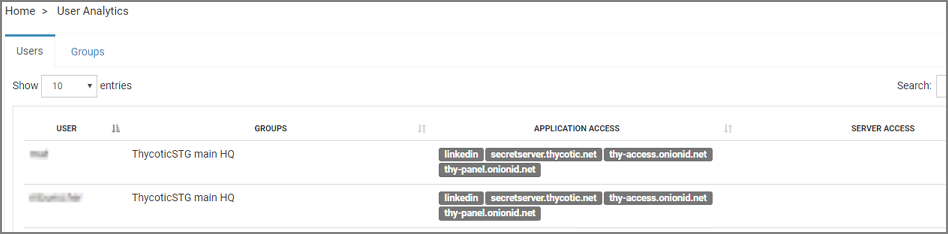

[title]: # (Analytics)
[tags]: # (thycotic access control)
[priority]: # (7)
# Analytics

The __User Analytics__ table provides you with a summary of the current access level of every organization user.
In details, for each user you can view all groups he belongs to.

## Monitor Application Access

Under __Application Access__ column the available applications are displayed.

If an application is not enabled for the group that user belongs to, it is shown grayed out as it is inactive.

The green checkmark indicates that the user has full access to the application’s restricted URLs and blocked Elements whether the   icon indicates that the user has restricted access to one or more Elements or URLs.

Click on an active application to view advanced details regarding the user access level on every restricted URL or blocked Element of this app.
<!-- 
 -->

## Monitor Server Access

Under __Server Access__ column you can review Windows or Linux server IPs or hostnames that the user has access to.

By clicking on a Linux server IP, you can see the account username(s) provided to the user for SSH login, whether he has sudo permissions or not and if it is manageable through Onion ID panel (See Provision Users for Linux Server section). On a Windows server, the RDP account username is being displayed instead.