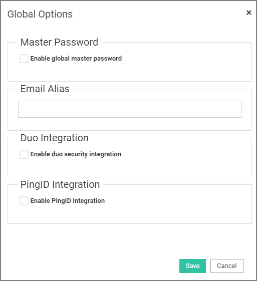
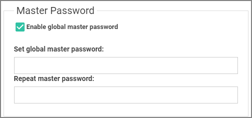
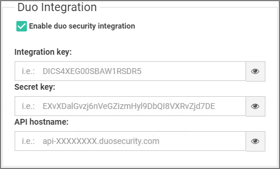
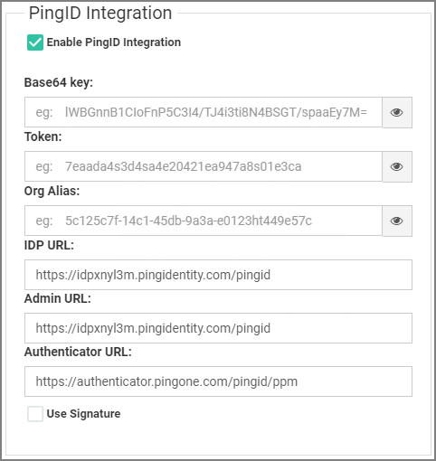
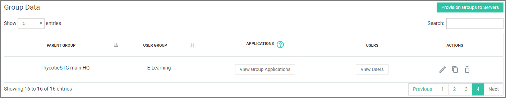
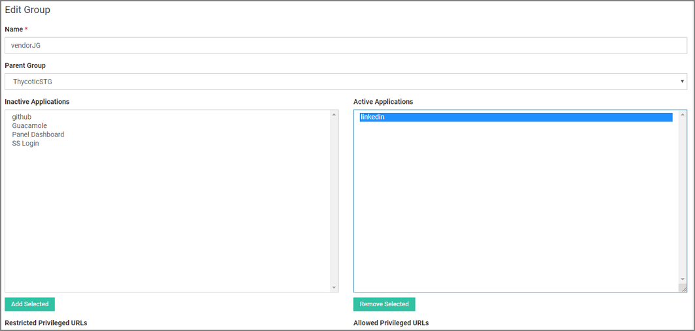

[title]: # (Groups)
[tags]: # (thycotic access control)
[priority]: # (6)
# Create Group

Thycotic Access Control categorizes users into groups based on the available applications and the level of access. Hence, you will probably need to create multiple user groups with certain settings. To do so, click on the __Add Group__ button located at the top right hand corner of the main panel.

Enter a name for the new group and select its parent group. Remember that groups in the access controller are formatted in a parent - child tree structure.

Then, from the left column, select the applications you want to be available to the group users. Click __Add selected__ and the selected applications will be displayed under __Active applications__ section. Follow the opposite procedure to remove an application from the active applications list. By default, every group has a list of restricted URLs and blocked elements. During group creation, you are able to select any URLs or elements from the corresponding section and add them to the allowed URLs or unblocked elements section respectively. Finally, click __Create__ for changes to take effect.

You are able to edit group settings later as well.

>**Caution**: If an LDAP service is running, this may create inconsistencies in the current organization schema.

## Set Global Options

In order to set global Access Control options, click __Global Options__ located at the top right corner of the main panel.

### Set Master Password

If enalbed, Access Controller users can login to organization applications through the Browser Extension (BE). During BE installation they are requested to enter a personal master password for extra security and for using it when basic authentication policy fails (See Enable fallback to master password for more info).

You are able to set a global master password for every organization user by checking the box and entering the desired password in the text fields below .

### Set Email Alias

In the text field shown enter an email address that will receive every kind of notification and alert emails regarding your Access Control. Organization admins will stop receiving these emails, if an email alias is set.

### Duo Integration

If enabled, users can authenticate using the DUO app.

### PingID Integration

If enabled, users can authenticate using PingID.

## View Group Data
  

The Group Data table contains all organization groups. In the first two columns you can see the name of the group __User Group__ and its parent __Parent Group__.

Click __View Group Applications__ to view a list of the available applications for this group.

### Edit Group

If you wish to edit a group click the edit icon under __Actions__ column. 
 

  
You are now able to change the group’s name and the parent group it belongs to, add or remove active applications, allow or restrict URLs and block or unblock elements according to the group access management that fit your needs. Remember to click __Update__ for changes to take effect.

__Copy__ or __Delete__ a group by clicking on the respective buttons.

>**Caution**: You have to be very careful when delete a group. All of its subgroups will be deleted. This operation cannot be undone. Consider moving the subgroups before continuing. Also, if an LDAP service is running, it might cause inconsistencies.
