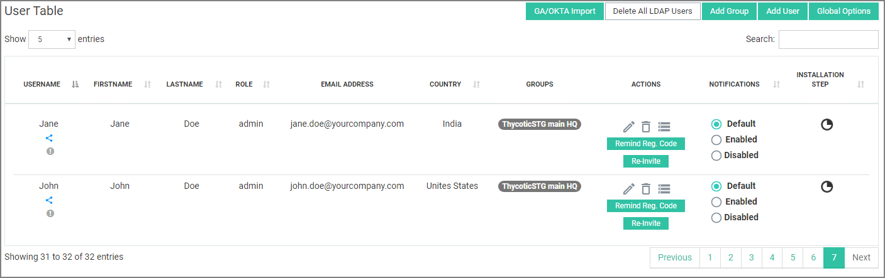
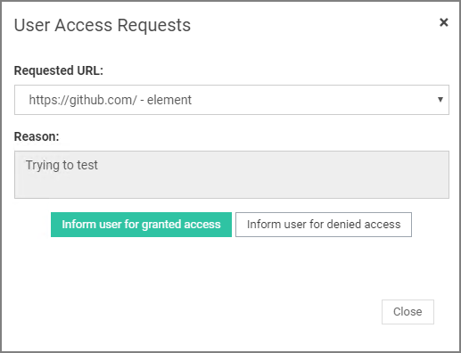
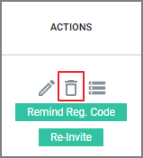

[title]: # (Users & Groups)
[tags]: # (thycotic access control)
[priority]: # (5)
# Users and Groups

## Users

The Users’ table contains every user that belongs to the selected organization (i.e Thycotic organization is selected in Figure 4.1).

For each user you can view basic information such as his username, his personal info (firstname, lastname, etc), the role assigned to him and the group he belongs to. In addition, there is an indicator in the __Installation Step__ column that shows which part of the installation process has been completed by the user. This feature can be useful for the admin to monitor how users are going with the process and step in when believes it’s necessary.

Besides displaying user information, there are some core actions available to the administrator, as explained below:

### Share User Credentials

You can share a user’s credentials by clicking __Share__ under user’s username. For more info refer to [Share account credentials in the Applications](../applications/cfg.md) section.

### Handle User Access Requests

A user might not have the permissions to access certain URLs or Elements that are blocked by the group he belongs to (See Set Privileged URLs & View/Remove Blocked Elements for more info). However, he is able to request access to some restricted elements through the browser extension.

These requests can be displayed by clicking the info button under the user’s username. From the popup window that comes up, you can review the request and inform the user if his access was granted or rejected. 

>**Important**: If you decide to grant access for an element (or URL) to a user, you have to do this manually by adding the user to a group that already has access to the specific element. For example, user A belongs to group G that restricts access to an element E. User A requests access to E. Organization admin can either create a new group that allows access to this element (See Create Organization Group for more info) or add user A to a group H that already have access to element E. 

### Edit User

If you wish to edit a user’s data click the button under __Actions__ column. Form this page, you can edit a user’s personal information, assign him a new role and/or add him in a new group. Remember to click __Update user__ for changes to take effect.

Copy a user by clicking on the   button under __Actions__ column.

### Delete User

If you wish to delete a user click the  button under __Actions__ column. This action will perform a soft delete, which means that the user can be retrieved if needed in the future.

In case you want to delete a user permanently, click the __Hard delete__ button after soft delete has been performed.

>**Important**: You have to be careful before deleting a user. There might be inconsistencies if an LDAP service is running.

### Provision to Accounts

If you wish to grant access for a user to one or more applications or servers, click on the button under __Actions__ column. This feature will allow user to login to either the selected applications by using newly generated credentials, or the selected servers by choosing one of the existing accounts.

### Grant User Access to Application

In the displayed popup window, click __Applications__ radio button and then choose one or more applications in which you would like the user to be able to login. 

The request will be handled by Onion ID Admins and your user will then have access to the selected apps. 

### Grant User Access to Servers

In the displayed popup window, click __Servers__ radio button and then choose the server you would like to give access to. Then choose one or more accounts that will be given to the user in order to be able to login to the selected server.

Remember to click __Update__ for your changes to take effect.

## Send Initial Registration Code Reminder

It is quite common for users to forget their Initial Registration code. You can send them a reminder email with their code by clicking __Remind IRC__ under the __Actions__ column.

### Re-invite User

If you wish to resend the registration email to the user once again, click __Re-Invite__ under the __Actions__ column.

## Import Users to organization

In order to import users into your organization, click __CSV/LDAP/GA Import__ located on the top of the main panel. From the pop-up window that comes up, select between CSV, LDAP/AD, Google Apps or OKTA depending on the import type you want.

### Import Users from CSV

Select CSV from the __Select import type__ drop-down menu and then choose the csv file to import. A CSV sample is available to help you understand the desired format of the uploaded CSV. Just click on the __Sample CSV__ button at the bottom left corner of the pop-up window.

### Import user from LDAP/AD

Thycotic Access Control provides you with the capability to import users from your Active Directory/ies into your organization.

Select LDAP from the __Select import type__ drop-down menu and then fill in the required fields that appear. Specifically: 

* LDAP Service Hostname: The hostname of the Active Directory or of another LDAP server, e.g. OpenLDAP.
* LDAP Service Port: The port that the server above answers to.
* Certificate Content: If the connection to the server is a secure one, paste the content of the corresponding certificate here.
* Use SSL/Use SSLv3: Select the type of SSL connection supported by the server above.
* Searchbase: The location in the LDAP directory that Onion ID LDAP will start looking for users and/or groups.
* Active Directory: Check this box if Onion ID is going to import users from an Active Directory. Leave it unchecked otherwise.
* Import Groups: Check this box if you want user groups to be imported as well.
* Debug Level: Choose __Info__ in order to receive basic log data from the LDAP service. __Debug__ option is for advanced logging.
* Update time (min): Enter the time interval between consecutive LDAP import requests. Time is in minutes, so please take caution before setting this field. For example, 1440 m (= 1 day) or 2880 m (= 2 days) would be accepted input.
* Username/password: The required credentials in order to login to the LDAP server.
* Attribute names: A list of active directory attributes that you want to be imported for every user in the Onion ID Panel. Set in each field the corresponding attribute name used in the in LDAP schema, e.g. either of the active directory or another LDAP implementation.

#### Import Users from Google Apps

Detailed step by step instructions are provided when __Google Apps__ option is selected from the __Select import type__ drop down menu.

#### Import Users from OKTA

Detailed step by step instructions are provided when __ΟΚΤΑ__ option is selected from the __Select import type__ drop down menu.

### Delete All LDAP Users

Requirements: You must have imported users from LDAP to perform this action. See in Import users from LDAP for more info.

If you wish to delete every user that has been previously imported from LDAP, click the __Delete All LDAP Users__ button. We strongly advise you to use this option only when it’s really necessary and in cases of a faulty or mistaken LDAP import.

>**Caution**: Users are going to be deleted permanently!
 

