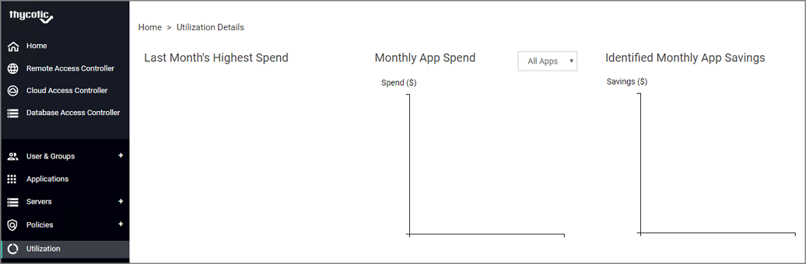
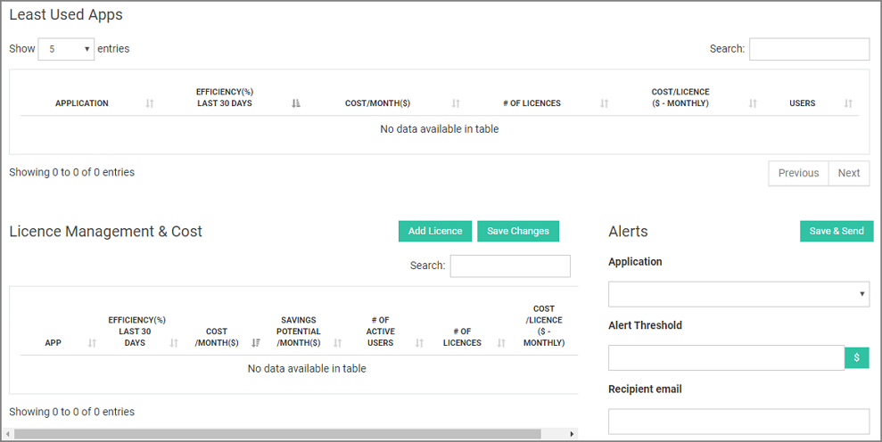
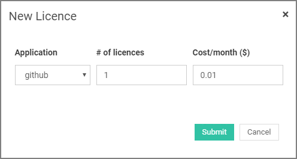

[title]: # (Utilization)
[tags]: # (thycotic access control)
[priority]: # (7)
# Utilization

Monitor your financial data regarding your applications through __Utilization Details__ panel and analyze the feedback based on your users interaction with organization apps.

## View Least Used Apps

Under this subsection you can view the applications which have been less used by organization users.
<!--
 -->

This piece of information help you understand if it worth keep paying for application licences that are not used. Click on the __View User Details__ to view the infrequent users and the amount of logins performed by them in the past one to three months.
<!-- 
 -->

 You can then ask your IT department to revoke their access to the app by checking the box that corresponds to their username and click __Notify to revoke__ button.

As shown, you can have a quick review of your financial data from the charts illustrated at the top of the page.

## View License Management & Cost

Let’s say that you have bought a licence for an application that has been integrated in the Access Controller in order for your organization's users to be able to login through the browser extension/mobile app, you can add the license here.  
Click on the __Add License__ button to add your licence financial information to the panel and then click __Submit__ button. 

From the table shown under this subsection, you can monitor financial information for every application licence you have entered and modify your data if needed.
In addition, you can be notified with an email alert whenever a specific price or efficiency threshold is reached. Select the desired application, set the alert threshold and set the recipient’s email address. Click __Save & Send__ button to create the alert.
<!-- 
 -->