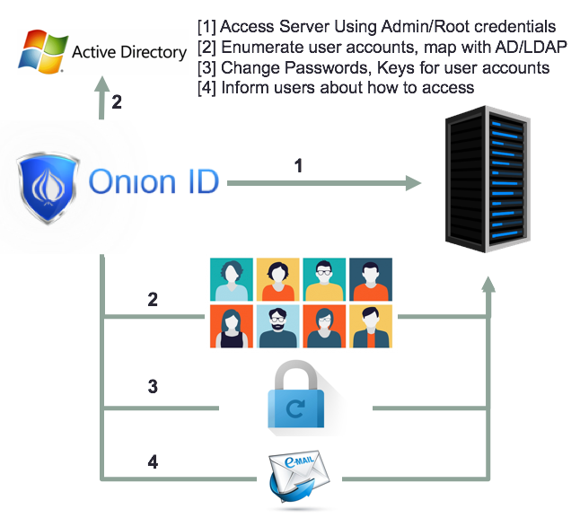

[title]: # (Authentication Workflow)
[tags]: # (cloud access controller)
[priority]: # (201)
# Authentication Workflow

Cloud Access Controller focuses on simple yet strong authentication. Wherever possible Cloud Access Controller attempts to not use passwords and use other alternate modes of authentication – such as SSH keys. For a typical authentication workflow, we will refer to the server onboarding diagram below and provide a narrative for how the authentication works from end to end. Customers will typically follow the workflow as listed here:

* Customer will add a server to the Cloud Access Controller system using root credentials (similar to Chef/Puppet/Salt/Ansible) to Cloud Access Controller. On doing so, Cloud Access Controller will access the server and enumerate all the user accounts on the server.

* Cloud Access Controller can also be tied up to LDAP/AD so that customers can map user accounts from the directory service to the local accounts on the servers.

* Cloud Access Controller proceeds to change credentials like SSH keys and passwords for user accounts on the server, preventing direct logins into the server.

* Cloud Access Controller sends emails to intimate the users allocated to use the server that they can access the server and provides what commands need to be used for access.  

Cloud Access Controller terminates SSH and RDP connections at the Cloud Access Controller SSH and RDP proxies. This means that the Cloud Access Controller system has access to the unencrypted bits flowing
between employee laptops and the target servers.

>**Note**: Cloud Access Controller can also regularly change passwords and SSH keys automatically on a regular basis, thereby helping with specific compliance requirements for strong credential
rotation. This allows Cloud Access Controller to perform authorization workflows as described
below.

Cloud Access Controller works best using SSH keys that Cloud Access Controller controls and manages. Customers can use LDAP based authentication, however, it is important to note that during LDAP based authentication Cloud Access Controller talks with the LDAP server to verify the credentials provided by the user. Cloud Access Controller layers Two Factor Authentication and provides session recording, command introspection and more – but – does not take responsibility for authentication (since LDAP is the trusted authentication source).
