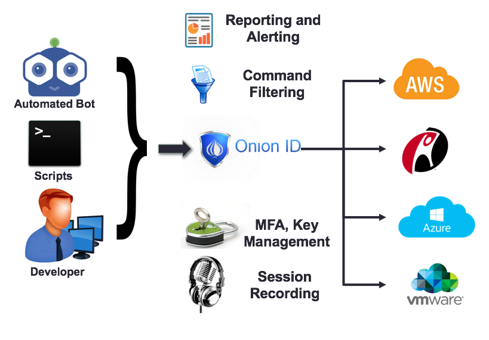

[title]: # (Nuances of Root Account Mgmt)
[tags]: # (cloud access controller)
[priority]: # (203)
# Nuances for Root Account Management

## Production Ready Architecture

Here we present a visual representation of the various elements that can employ the Cloud Access Controller system in a stable production environment.

## Options

As mentioned above Cloud Access Controller has the capability to set, change and rotate SSH
keys. On most Linux server there is always an administrative “Root” account that is often employed for privileged actions. Cloud Access Controller makes it easy to protect this root account. When a server is added to Cloud Access Controller. The system can optionally change the login mechanism for a root account from password based to key based and generate, and set the appropriate SSH keys under the root user on the target machine. Additionally, Cloud Access Controller turns off raw password based logins for the root account. This accomplishes two objectives:

1. Employees do not need to know the password for root accounts
1. Employees can login to the root account by using their existing SSH keys

From the above, #1 reduces the risk exposure by preventing raw passwords from being in the hands of any human user and #2 helps provide a consistent, easy experience for any employee to access the root account, provided the Cloud Access Controller administrators have given them access to the root account. As an example a login to the root account would use a command like:

`ssh –p 2222 employee\~root\~server.com\@ssh.onionid.com`

Cloud Access Controller can also rotate the SSH key for the root account on a regular basis, thereby making sure compliance controls for SOC2, SOX, PCI, NIST and ISO are in place. The only exception to the above is in the extremely unlikely case where Cloud Access Controller attempts to rotate the SSH keys of the root account and a network disruption happens. To provide for a failsafe, before the SSH key for the root account is rotated, Cloud Access Controller enables password based logins for root, and then rotates the keys, then turns off password based logins if all actions were successful. This is to provide a mechanism for IT admins to access the target machine with a raw password in exceptional circumstances. We recommend that all root passwords for any machines be stored in Cloud Access Controller’s secret storage area.
