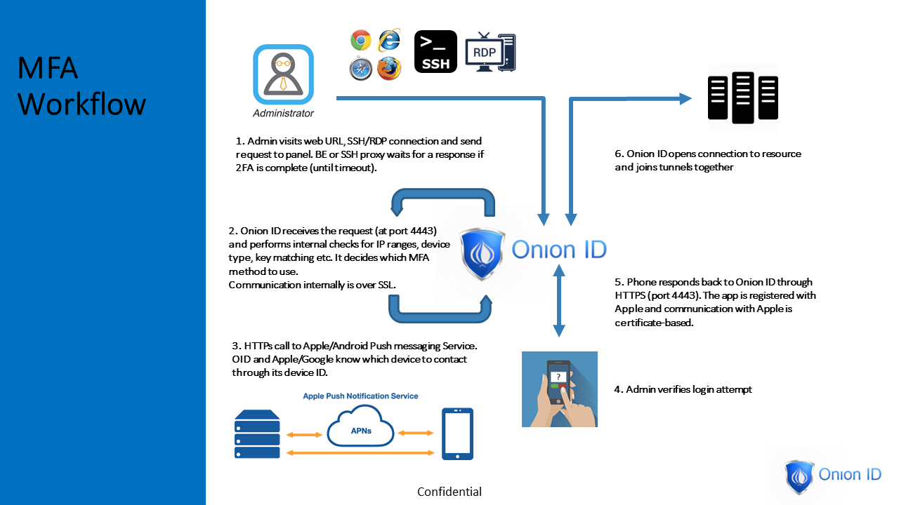

[title]: # (Multi-factor Overview)
[tags]: # (cloud access controller)
[priority]: # (300)
# Multi-Factor Authentication Overview

Onion ID is a single pane of glass to provide security, visibility and auditing for any enterprise. Onion ID’s flexible and powerful solution provides you with the power of choice. Enterprises select how much security is right for them and how they want to implement it. This document provides an overview of the various options available to customers for Multi Factor Authentication (MFA).

Onion ID provides an application for Android (Google) and iOS (Apple) smartphones. This application is used to tie in the identity of the end user with the MFA authentication process. The smart phone application can measure various parameters on the user’s phone and communicate with the Onion ID system
to verify if the access to a resource is legitimate or not.

## Options for MFA

| Option | Description |
| ---- | ----- |
| Biometric | Use Fingerprint sensor on phone. If no Fingerprint is available, use PIN of the phone. |
| Bot Prevention | Use Gyroscope on the phone to detect movement of the phone, helps prove human or bot access. |
| Location | Use GPS on phone to geo-locate end user and implement access controls. |
| Proximity | Use heuristics to only allow access if phone and laptop are close to each other. |
| Master Password, YubiKey, and Duo | More traditional and non-phone based MFA options. |

## Example Workflow

* Employee logs in to office Desktop and opens the browser to visit a SaaS application.
* Employee wants to login to the application on behalf of the company to perform actions.
* Onion ID sends a push message to the employee’s phone asking employee to shake their phone and use their fingerprint sensor on the phone.
* Employee picks up the phone, clicks on the push message and shakes the phone then puts their finger on the fingerprint sensor.
* Onion ID recognizes that policy has been satisfied and logs the user into the application.

