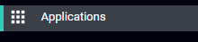

[title]: # (Add Applications)
[tags]: # (thycotic access control)
[priority]: # (8)

## Add Applications

To add an application

1. From the left menu, select __Applications__.

1. Click __Add Application__.

   
1. On the __New Application__ window

   * Enter the Application URL
   * Enter the Display Name
   * Choose if the application relates to an existing application and/or if the application is internal.
        * If the new application **is related** to an existing application, the application will be instantly added to your panel. _For example: If your application list already contains Salesforce, and you would like to add Salesforce China, use a unique name such as 'Salesforce China' and specify the appropriate URL. Then, indicate that the new application is related to the already existing 'Salesforce' application from the drop-down list. Usage of this option allows you to have different application tiles for different URLs that point to the same application._
        * If the new application **does not relate** to an existing application, Thycotic will receive your request and provision this application to the list of available applications within 24 hours. You will be notified with an email when the app is available in your panel. The application will initially appear as disabled, so you will have to enable it as described in: [Enable/Disable Applications](../admin/applications/enable-app.md).
        * If internal application is selected, then the application you have added will only be available for your organization's dashboard. This option should be used for non-public applications that are only accessible from inside your organization.
1. Click __Create__.