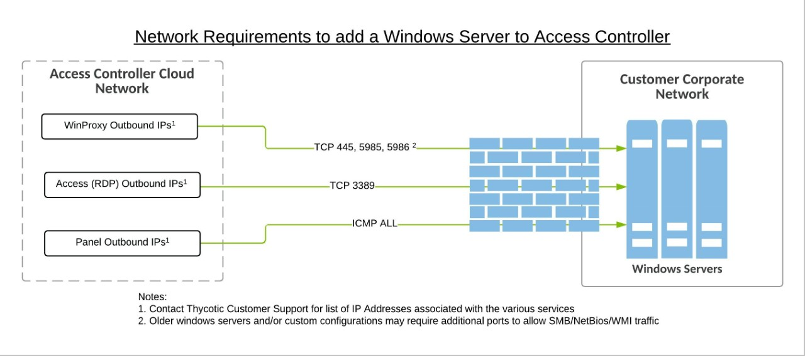

[title]: # (Add Servers)
[tags]: # (thycotic access control)
[priority]: # (7)

# Add Server

To add a new server

* Click **Servers** on the left-hand menu and click **Manage**

* Click __Add Server__ on the top of the main panel. The **Add a New Server** window appears.

* Use the drop-down menus to configure the new server.

## Windows Server

For a Windows server, enter its hostname or its static IP, the RDP port if needed and the domain name that might have been set up.

Select __Use already registered account credentials__ option if the server you are adding uses already stored credentials, which you used in the past for other servers. Choose the server with the same credentials from the dropdown menu that appears below.

Select __Register new account credentials__ option to enter credentials for the new server. Root credentials are required for remote account management (privileges, keys) and system configuration. It is a very common practice if you are also using tools like Chef, Puppet, Ansible etc.

### Windows Server Preparation

To make onboarding of Windows server to Remote Access Controller simple, Thycotic provides these PowerShell scripts to run on the local machine targeted for onboarding.

### Windows Server (Non-domain Joined)

> **IMPORTANT:** Make sure you use an account with execution privileges and that the local accounts you are providing access through Access Controller are members of the Remote Desktop Users group.

1. Download the zip file containing the prep scripts and extract its contents.
1. Store the “WindowsPrep.ps1” script on the target Windows server.
1. On the target server, click Start, type “PowerShell”, and then click on “Windows PowerShell”.
1. In the PowerShell window navigate to the location where the script was stored.
1. Type “WindowsPrep.ps1” and press Enter.

### Windows Server (Domain Joined)

Before provisioning, two PowerShell scripts need to be run on the target server, which configure it accordingly. To run the scripts, follow the instructions below.

> **IMPORTANT:** Make sure you use an account with execution privileges and that the local accounts you are providing access through Access Controller are members of the Remote Desktop Users group.

1. Download the zip file containing the prep scripts and extract its contents
1. Store the “WindowsPrep.ps1”and “GuacADEnable.ps1” scripts on the target Windows server.
1. On the target server, click Start, type “PowerShell”, and then click on “Windows PowerShell”.
1. In the PowerShell window, navigate to the location where the scripts were stored.
1. Type “WindowsPrep.ps1” and press Enter.

## Linux Server

For a Linux server, enter its hostname or its static IP and the SSH port if needed. If there is an LDAP service running on your server, choose __Yes__ to the corresponding dropdown menu. If you wish your server to belong to a cluster, click on the respective drop down menu and select the desired cluster.

In the Policy field, select the authentication method you wish to set for your server. This is a required option.
Select __Use already registered account credentials__ option if the server you are adding uses already stored credentials, which you used in the past for other servers. Choose the server with the same credentials from the dropdown menu that appears below.

Select __Register new account credentials__ option to enter credentials for the new server. Root credentials are required for remote account management (privileges, keys) and system configuration for Onion ID. It is a very common practice if you are also using tools like Chef, Puppet, Ansible etc.

Select __Enable script execution control__ to give users a limited shell where they can only run scripts via the script checker. If banned commands are detected in the script, execution is aborted and the admin is notified.

>**Caution**: If a cluster is chosen and has a defined policy, then it will apply to the new server. If the cluster policy is not defined, this policy will apply for all the servers in the cluster.

Remember to click __Save__ for changes to take effect.
