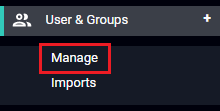
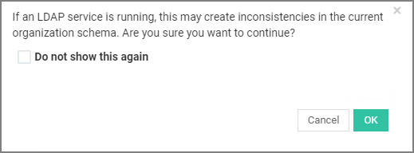

[title]: # (Add Users)
[tags]: # (thycotic access control)
[priority]: # (6)

# Adding Users and Groups

To create Users and Groups, use the left-hand navigation menu to click **User & Groups** and then click **Manage**. You will see the **User Table**.

## Add Users

To create a User

1. At the top right hand corner of the main panel, click __Add User__.
2. From the popup window, enter the user’s information into the displayed fields.
3. Select the role and group that you want the user to be assigned.
4. Click __Create User__ for the changes to take effect.

>**Caution**: Assigning the __Admin__ role to a user will allow them to login and change settings in the Access Control panel. Additionally, any manual user additions or deletions could cause inconsistencies if your organization has an LDAP service running.

## Add Groups

To create a Group
1. Click **Add Group** in the top right-hand corner of the main panel.

1. Enter a name for the new group and select its parent group. Groups in AC are formatted in a parent-child tree structure.
1. From the left column, select the applications you want to be available to the group users. Click __Add selected__ and the selected applications will be displayed under __Active applications__ section. To remove an application, click the application and then click **Remove Selected**.
1. By default, every group has a list of restricted URLs. To allow restricted URLs, click the URLs and then click **Add Selected**. The URLs move to **Allowed Privileged URLs** and users within the Group can access the URLs. You can hold **Ctrl** on your keyboard to select multiple URLs at once.
1. Every group also has a list of default **Blocked Elements**. To unblock elements, click the elements and then click **Add Selected**. The elements move to the **Unblocked Elements** list. You can hold **Ctrl** on your keyboard to select multiple elements at once.
1. Click **Create** to add the new Group.

>**Caution**: If an LDAP service is running, this may create inconsistencies in the current organization schema.
