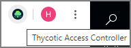
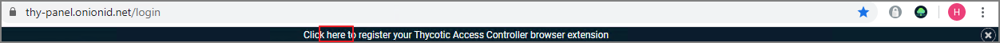
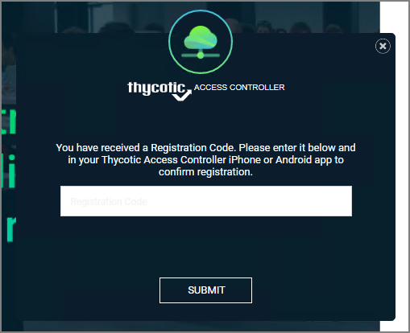
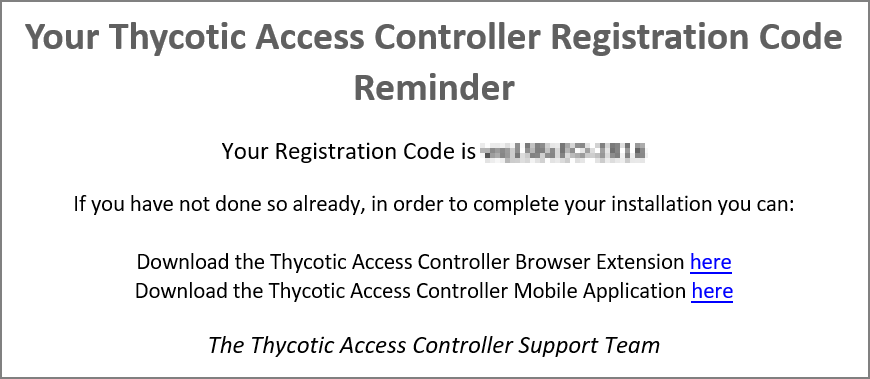
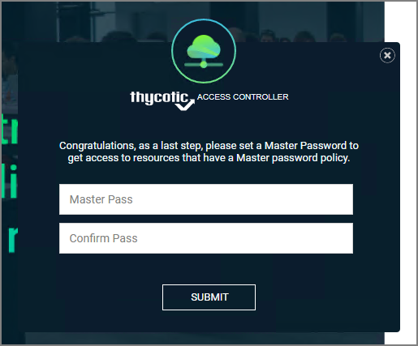
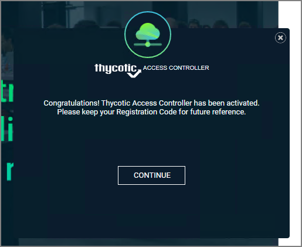

[title]: # (Browser Extensions)
[tags]: # (thycotic access control,setup)
[priority]: # (4)
# Browser Extension

The Browser Extension for **Cloud Access Controller** enforces MFA and automatically logs users in to web applications.

## Installing the Browser Extension

1. Use the link from your _Thycotic Access Controller Initial Set Up_ email or visit your default browser's extension store to install the Thycotic Access Controller browser extension. This guide uses the Chrome browser as an example installation.
    
    [Access Controller Extension for Chrome](https://chrome.google.com/webstore/detail/thycotic-access-controlle/iecelabbmmbhdepbemppjplnkenhoemo)

    [Access Controller Extension for Firefox](https://addons.mozilla.org/mn/firefox/addon/thycoticaccesscontroller/)
1.  Once the extension is installed, you will see the Thycotic Access Controller icon in your extension bar. If you cannot see the icon, you may have to restart your browser for the extension to finish installation.

    

1. Open the [Thycotic Access Controller login page](https://thycoticaccesscontroller.com/login). The registration banner is displayed on top of your login page.
    
1. Click the __here__ link in the message banner.
1. The Registration modal opens, prompting you for the Registration Code that has been emailed to you.

   

   The Registration Code has been provided via email and should be used for the registration of your browser __and__ mobile device.

   

   Enter the registration code and click __Submit__.
1. You are prompted to create a __Master Password__. Enter a master password of your choosing and confirm.

   

   Click __Submit__.
1. On the congratulations modal, click __Continue__.

   

After your account activation and successful registration via the browser extension, you will receive another email prompting you to register your mobile device.

Continue with [Mobile Device Registration](mobile.md)
