[title]: # (Mobile Registration)
[tags]: # (registration,mobile)
[priority]: # (5)

# Mobile Device Registration

The Mobile Application enforces **Multi Factor Authentication** for all of Thycotic's Access Controller products.

After a successful [Browser Extension](be.md) installation and registration, follow the link in your registration email or go directly to the [iOS](https://apps.apple.com/us/app/onionid/id954836301) or [Android Store](https://play.google.com/store/apps/details?id=com.programize.onionid&hl=en_US&gl=US) to download theThycotic Access Controller Application.

> **Note:** The iOS Access Controller Application is branded as **OnionID**.

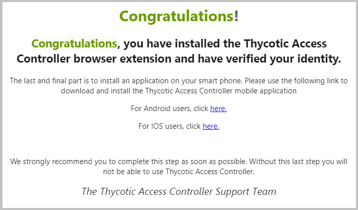

After installing the OnionID (Thycotic Access Controller) Application from your devices app store, follow these registration steps:

1. Open the newly installed mobile application.
1. The application prompts you for your registration code:

   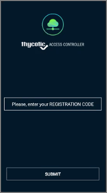

   Use the registration code that was emailed to you. It is the same code that you used for the browser extension registration.

   Click __Submit__.
1. The application prompts you to choose a 4-digit PIN. The PIN is used if TouchID/Fingerprint is not available or is not working.

   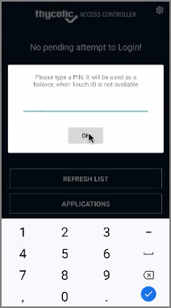

   Enter a 4-digit PIN and Click __Ok__.
1. On your computer, if you are currently logged into the panel, logout and reload the login page. Users that have not accessed the panel, open the login URL.
1. In the register modal, provide your user email and password, click __Register__.

   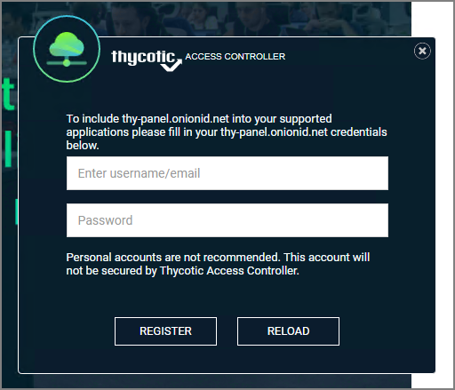

Your mobile device is now registered and ready to be used for subsequent logins.

## Using Mobile Authentication

After you have successfully registered your user account, every login to the Access Controller panel will authenticate via your mobile app.

1. Navigate to the Access Controller URL and open the panel login page.

   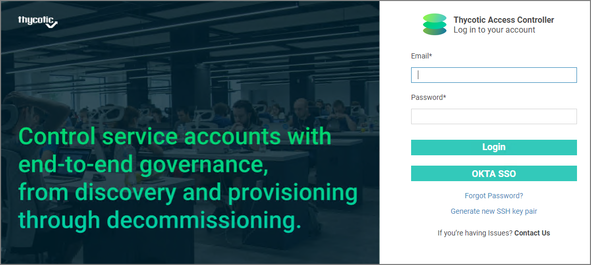

   The pending authentication modal opens:

   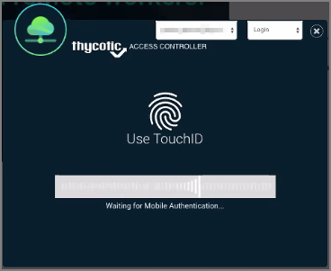
1. On your mobile device, open the Thycotic Access Controller application. The app displays a pending login attempt:

   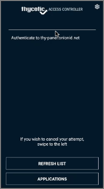
1. Click __Authenticate to...__
1. Either use your Fingerprint or a PIN to authenticate the login. We will use a PIN for this example.

   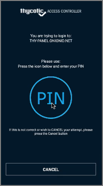

   Click __PIN__ and enter your authentication pin. Click __Submit__.

   On your computer, the panel application opens to the home page.

## Mobile App Settings

The mobile app also lets you change your PIN, unregister, and browse the applications that are setup in your organization's profile.

### Change your PIN

To change your mobile app PIN,  select the __gear__ in the top-right corner and navigate to the mobile app settings. Select __Change PIN__. You are asked to input your old PIN and then to enter your new PIN twice. Click __Submit__ to save the change.

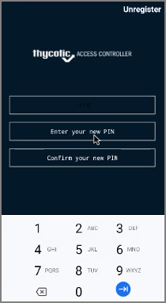

### Unregister

To unregister your device, select the __gear__ in the top right corner and navigate to the mobile app settings. Select __Unregister__ and confirm that you wish to unregister the mobile application.

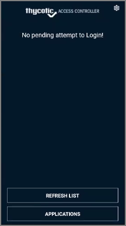

### In-app Browsing

You can navigate to a list of applications that are registered through your organization's panel. Select the application and associated account to login. Once authenticated, you can browse the application from inside the Access Controller mobile app.

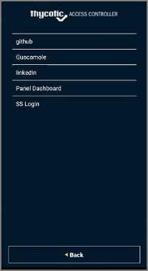
