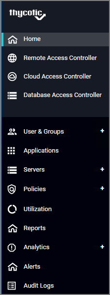
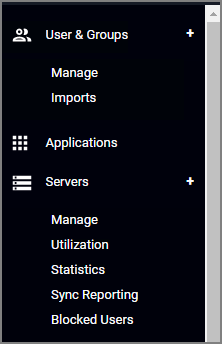
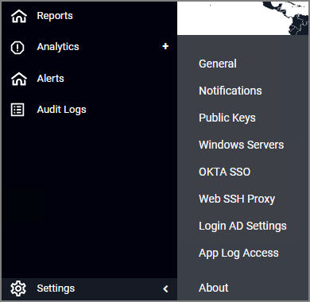
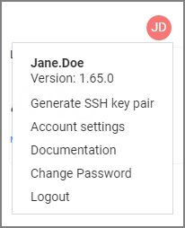
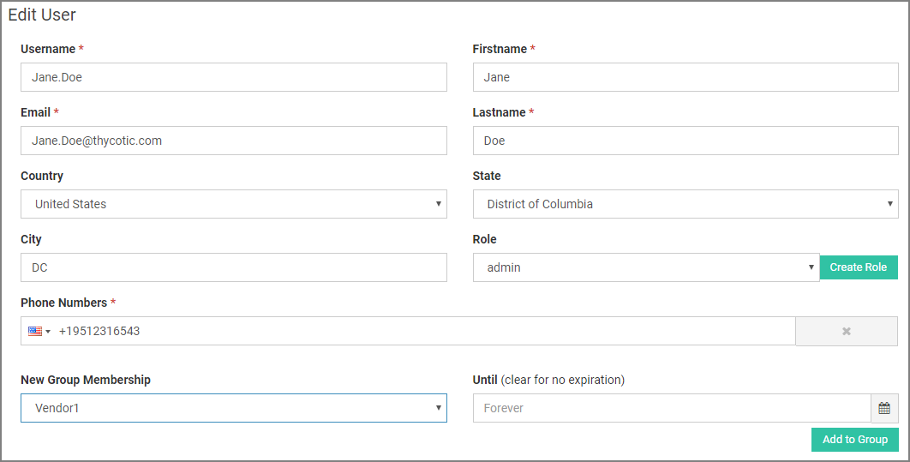
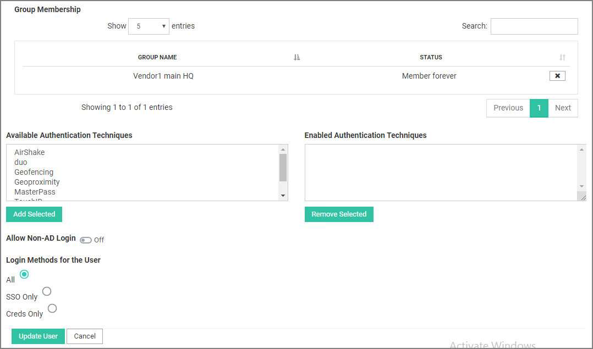
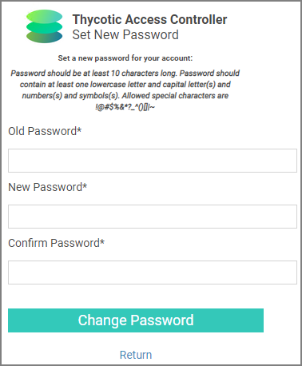

[title]: # (User Interface)
[tags]: # (thycotic access control)
[priority]: # (1)
[display]: # (none)
# UI Reference

## Left Navigation

The left navigation menu depends on your license terms. A customer with license to all Thycotic Access Controllers might see the following:

### Navigation Tree

Clicking the parent items expands the navigation tree:

### Collapsed Menu

The navigation menu can be collapsed via toggle:

## Settings Menu

The Settings Menu can be accessed via the Settings gear at the left bottom area of the navigation menu.

## User Account

You can access your account details via the user icon link at the top right corner of the screen.

### Generate SSH Key Pair

Administrators are able to use the Generate SSH key pair menu to create a new token.

### Account Settings

User account details can be edited via the Account Settings menu option.

### Documentation

If you are in the product, use the Documentation link to open this Thycotic Access Controller documentation portal.

### Change Password

Use the Change Password menu to update your current password. Users are required to also provide the current password in order to change it.

Users that have a mobile app registered will be prompted to authenticate through the mobile device prior to being able to change their password.

### Logout

Use the Logout option to logout of the panel.