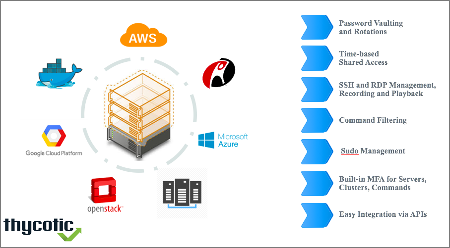

[title]: # (PAM Overview)
[tags]: # (thycotic access control)
[priority]: # (99)
# Server Privileged Access Management

Thycotic's Server PAM secures privileges for accounts on Cloud Servers (AWS, Rackspace, SoftLayer, private clouds), Containers (Docker, CoreOS) and Web Applications (Salesforce, Office 365, Google) in 60 seconds.

Easy Server Account Management, Easy MFA for SSH and RDP with Zero Code Installation, Easy Active Directory Bridging for \*nix servers, Command filtering, Sudo user mapping for access control – all in one convenient single pane of glass for PAM (Privileged Access Management).

Thycotic's Server PAM provides an easy Privilege Grant and Management mechanism for Accounts on Cloud, On premise, data center servers and containers. Customers can safely share administrative account access on servers with multiple employees, while ensuring that each employee can only perform specific tasks, can utilize the privileges during a given time window and validate their identity with easy, low friction MFA. Thycotic's Server PAM helps insert a transparent Privilege Management layer so customers can choose to use their RHEL, Ubuntu, Debian, CentOS, z/OS, Archlinux and Windows servers and demonstrate tight control over authentication, authorization and auditing processes. Thycotic's Server PAM helps customers layer privilege management with zero agent installation and provides flexible alerts, automated compliance reports, automated Key and Credential management with Step up Authentication and Authorization for elevated privileges.

## Features

### Benefits

#### Compliance

Clearly demonstrate the ability to control user identities for access to server clusters. Comply with requirements that prevent providing passwords for servers to employees. Comply with automated password and key reset requirements while being able to show separation of roles and duties on every server in a cluster. Generate automatic compliance reports and cut down manual effort.

#### Auditing

Capability to Audit who has access to what. Drill in deeper to see how much access a person has inside any server, whether they are part of privileged groups, and what commands have been executed by them. This helps with visibility into how highly sensitive accounts on servers are being used (e.g. Root/sudo accounts on Linux servers). Identify anomalies within groups of users to see which individual has unusually permissive access rights.

#### Security

Prevent misuse - accidental or malicious - of privileged accounts on servers. Layer the trust by verify model by generating video recordings of SSH and RDP sessions, and have the ability to search via text through each session. Use limited shell based features, command restrictions, set up break the glass accounts and IP ranges and control parallel sessions easily with built in MFA policies.

#### Sample Workflow

* IT Admin of customer (ITA) visits the Onion ID dashboard and can add one or many servers.
* ITA can then delegate privilege management of these servers to Onion ID and can see which accounts already have access to the server by linking up Active Directory or LDAP.
* ITA can simply map user identities (pulled in by Onion ID from AD, LDAP) to accounts on a server. Example – User A can access service account 1 on cluster 3.
* ITA can set up various MFA rules so that when employees access the server clusters, they verify their identities using strong authentication.
* ITA sets up automated password and key rotations for all accounts on all servers.
* ITA can now streamline access grant process using Onion ID’s Jira and Zendesk Helpdesk integrations.
* Employees can now be granted Sudo rights, access to accounts and servers, with time restrictions and with command blacklisting in place.
* ITA can generate automated compliance reports to audit who has access to which account on which server.
* Additionally, ITA can automate employee off-boarding and onboarding process by syncing Onion ID every few minutes with the directory structure eliminating manual account creation and deletion.
