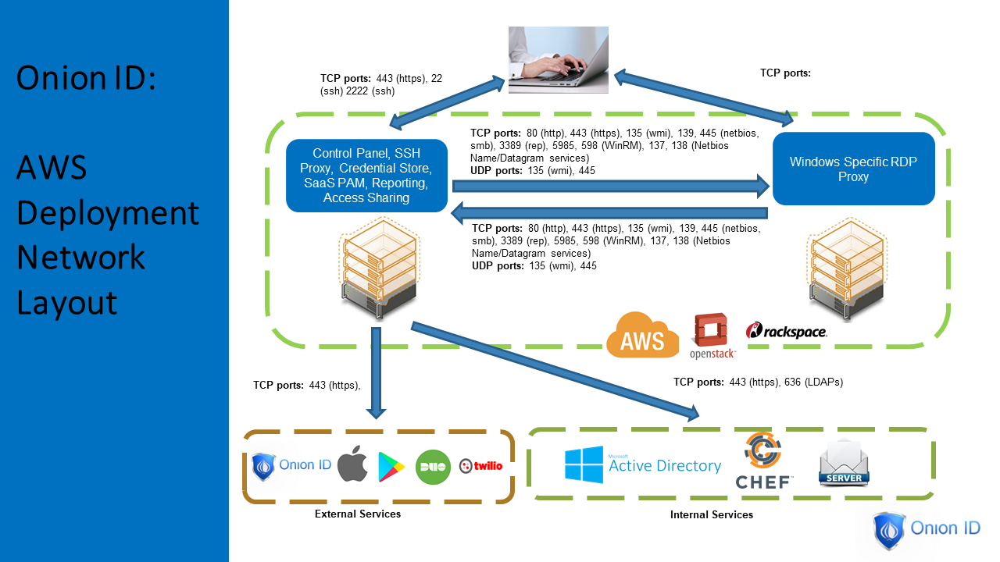

[title]: # (Remote Access Control)
[tags]: # (remote access controller)
[priority]: # (300)
# Introduction to Remote Access Controller

Thycotic's Remote Access Controller provides access management for employees and contractors. Remote Access Control (RAC) is used to enforce an organization's policies, such as requiring multi-factor authentication or session recording.

Easy User Management, SSH Key Insulation, Credential Rotation, Access Auditing, License usage tracking, Anomaly detection, MFA enabled VDI and Secret Storage – all in one convenient single pane of glass.

Thycotic provides an easy, light weight VDI interface that helps compliance and security focused customers to create a web portal from where employees and contractors can access:

1. An entire Linux or Windows desktop, with full functionality of the Operating System.
1. A specific web application only with no ability to resize or close the captive browser.
1. A specific thick client application only.

The LightVDI offering from Thycotic provides built in MFA, tunable according to the user identity, type of application and location of the employee or contractor. With built in no-copy-paste and no-file-transfer mechanisms, all corporate data in the VDI environment is guarded securely. Thycotic’s LightVDI product scales elegantly to hundreds and thousands of connections owing to its (AWS) auto-scaling properties and comes built in with load balancing for optimal performance. The LightVDI offering can be deployed by customers in either full SaaS mode, hosted by Thycotic, or deployed in a virtual private cloud by the customer in their environment.

## Benefits

### Compliance

Secured access provided to employees and contractors to sensitive resources and at the same time full session recording for FFIEC, NIST, SOX, SOC2 framework adherence is available. Separation of duties is easily achieved on accounts and automated reporting cuts down manual effort.

### Auditing

Capability to Audit who has access to what, and what have they done with their access. This helps with visibility into how highly sensitive pieces of information are being used.

### Security

Flexible control over how the resources can be accessed, used and updated. Adaptive Multi factor Authentication is built in to provide strong guarantees for identity verification and intent to perform an action.

### Cost Effective

At least 2-3x more cost effective that existing VDI solutions, requires less hardware and can work well with auto-scaling in AWS to optimize costs according to number of users on the system.
