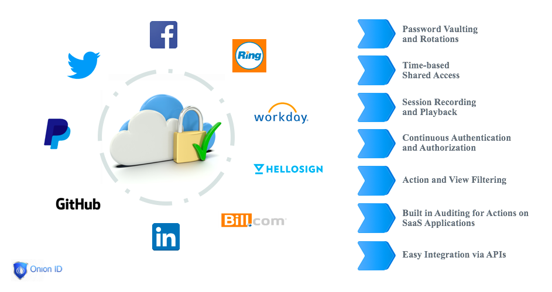
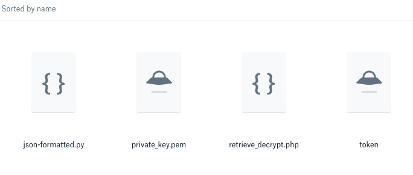
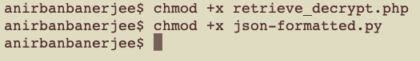
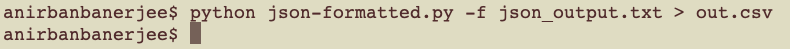

[title]: # (DR API Workflow)
[tags]: # (access control)
[priority]: # (15)
# Disaster Recovery API Documentation

Thycotic Access Control provides an easy Privilege Grant and Management mechanism for SaaS and legacy web applications. Customers can safely share administrative account access on SaaS applications with multiple employees, while ensuring that each employee can only utilize the minimum functionality necessary for their job function. Thycotic Access Control helps insert a transparent Privilege Management layer so
customers can choose to use their favorite SaaS and web applications and yet be able to demonstrate separate of roles and duties on shared accounts. This is truly the best of both worlds: SOX, SOC2, PCI, NIST, FFIEC, NCUA, NERC, ISO, GDPR guidelines can be respected for compliance and auditing purposes while sales, marketing, HR, IT and other teams can continue to use their chosen SaaS applications with zero interruption.

## Thycotic Access Control SaaS PAM Features

## Disaster Recovery API Details

### Audience

The Thycotic Access Control Disaster Recovery API is meant to be used by Thycotic Access Control administrators on the customer side who are familiar with PHP, Python and shell scripts.

### Collateral

In order to use the Thycotic Access Control Disaster Recovery API the Thycotic Access Control administrator(s) on the customer side will need to possess a few pieces of information:

* The URL of the API endpoint, typically <https://panel.onionid.com>
* A token, which is a simple text file containing a long string of characters
* A private key, in pem format, this is also a text file containing multiple lines of characters
* A php script file that will interact with the Thycotic Access Control API and pull out the credential information for disaster recovery purposes
* A python script that will provide formatting for the output obtained from the previously mentioned php script

Please contact your Thycotic representative to acquire these important pieces of collateral.

### Minimum System Requirements

Thycotic Access Control administrator(s) will need to have either a Linux or Mac OS X machine with php and python libraries installed on their system. Command line terminals should be used to interact with the collateral mentioned above.

### Sample Workflow

IT Admin of customer (ITA) downloads the collateral from the (customer specific) corporate Thycotic Access Control Dropbox account. All collateral specific to your organization, and for the purposes of the usage of the API, will be available here. Please connect with your Thycotic Access Control representative to obtain your custom Dropbox link.

The ITA will need to make the php and python scripts executable by running the following commands.

`Chmod +x <path-to-php-script>`
`Chmod +x <path-to-python-script>`

#### Phase 1 – Extracting information out of the Thycotic Access Control API

The ITA will now run the following command on the command line

`Php -f <path-to-php-script\> <path-to-token\>         <path-private-key-pem> json-output.txt`

#### Phase 2 – Formatting the information for easy consumption via a spreadsheet

The ITA will now run the following command on the command line

`Python <path-to-python-script> -f json-output.txt > output.csv`

The ITA can now open the file output.csv in a spreadsheet editor like Excel.

Please connect with <support@onionid.com> or your Thycotic Access Control representative for any questions or guidance that may be needed.
