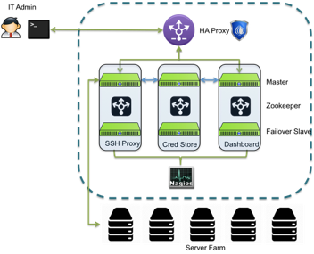

[title]: # (DR/HA Overview)
[tags]: # (thycotic access control)
[priority]: # (1)
# Disaster Recovery and High Availability Overview

Thycotic Access Control is a single pane of glass to provide security, visibility and auditing for any enterprise. Thycotic Access Control’s flexible and powerful solution provides you with the power of choice. Enterprises select how much security is right for them and how they want to implement it. This document describes the measures taken by Thycotic Access Control to provide for disaster recovery and high availability for all customers.

## Thycotic Access Control

Thycotic Access Control (OID) is a next generation PAM solution. Thycotic Access Control has been built from the ground up for enterprises with scaling, security, reliability and availability in mind. OID allows any organization to quickly manage employee accounts and privileges by using a customizable, low friction, self-service mechanism. Once users (typically employees) are registered with OID, IT and DevOps can (1) set up policies for access and privilege control to 3rd party cloud services (Salesforce, wiki, Jira, Marketo) and infrastructure (AWS
servers, bare metal, containers) (2) get complete visibility on who is accessing what, from where, when and how (3) identify inefficient usage of resources (4) automatically provision/de-provision users and (5) conduct forensic analysis into employee activity.

## Disaster Recovery and Backups

Thycotic Access Control utilizes cloud storage offered by AWS S3 to store service information for backup purposes. Thycotic Access Control performs regular backups to make sure that in the event of a server loss customer data is still accessible and available. Each server is backed up to a distributed store. Furthermore, all databases are also backed up constantly to ensure that both server information, database
information is fresh when restored from the backups. Thycotic Access Control has internal procedures to train personnel in the case disaster recovery processes kick in. Amongst the Thycotic Access Control employee list there is always one person (SRE/DevOps) in charge of service availability and recovery.

## Redundancy at the Global Level

Thycotic Access Control recognizes the critical nature of the service we offer. Redundancy can be built into a service at many levels.

Thycotic Access Control has redundancy as part of its architecture at every stage. At the global level Thycotic Access Control utilizes multiple cloud providers like Amazon AWS, Rackspace, Digital Ocean, Host Europe Group, Tsukaeru (Japan). The goal is to load balance and provide optimal performance based on the customer location and in the case of an entire data center failing, to ensure continuity of services.

## Redundancy within a Single Cloud Provider

Thycotic Access Control staggers its infrastructure within cloud providers based on zones. As an example, Thycotic Access Control utilizes various geographical zones such as US East Coast, US West Coast, Chicago and more. Similarly, with Rackspace various data centers on the US West coast, Central US and US East coast are used to deploy servers.

## Redundancy within a Single Zone

Thycotic Access Control has granular redundancy built in. At any single cloud provider (e.g. AWS) Thycotic Access Control implements a pod based approach. These pods use various load balancing and redundancy technologies that allow Thycotic Access Control to use clusters of
servers to service any requests. The diagram above depicts the pod structure. 

In the case of AWS, the actual software used ELB versus HA Proxy may be different. However, the pods contain master slave configurations in hot swappable mode. Further HA Proxy or ELB ping both servers in real time to identify slow responses and load balance the requests. Each Master and Slave has an individual cluster associated with itself. Every stage of processing a request has fault tolerance built in.

## Redundancy for Sustaining DDoS

Thycotic Access Control is in the process of migrating a portion of its DNS to the anti DDoS service CloudFlare to contain the effect of a Denial of service attack.
