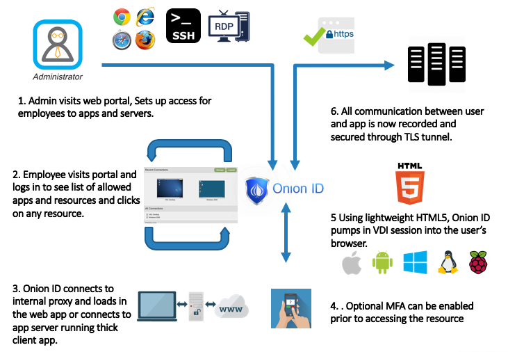

[title]: # (Workflow)
[tags]: # (remote access controller)
[priority]: # (200)
# Sample Workflow

* Customer Administrator sets up apps accessible for employees and contractors.
* Employees and contractors login to web portal (LightVDI.customer.com), optionally integrated with existing SSO on customer side.
* Employees and contractors see clickable links to applications and resources they are allowed to access.
* On mouse click Onion ID loads in VDI environment and presents full Operating System or only an application to the user.
* Entire session is recorded, copy-paste and file-transfer, network-drive-mounting are disallowed by default but can be switched on for individual users if needed.
* Customer no longer needs VDI client on employee or contractors laptop, furthermore the Onion ID LightVDI offering works on Android tablets, iPhone, Mac, Windows OS, Linux and more devices – even ones without a physical keyboard.

