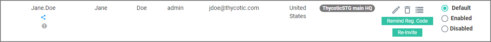

[title]: # (Activation)
[tags]: # (thycotic access control)
[priority]: # (1)
# Activation

After your user account has been created by your organization's Access Controller System Administrator, you (the end user) will receive an email with credentials (username & password) to login into your user account for the first time. You will also receive a link for activating your newly created account. The email arrives from __Thycotic Cloud Access Support__.

The link in the registration email, directs you to the __Thycotic Access Controller__ login page.

## Setting new Password

You must set a new password for your account. When the new password is set, you will automatically be logged in and redirected to your dashboard. Use the dashboard to setup and manage the Thycotic Access Controller for your organization.

## Home Dashboard

After you are logged in, the home dashboard opens. Showing default statistics for your portal.

## User Registration - Browser/Mobile App

With the login or user creating in the Access Controller portal, a Registration Code is emailed to the user. In case the registration code needs to be resend, 

1. Navigate to __User & Groups__.
1. Select the user entry and click __Remind Reg. Code__.

   

The email will have links to the browser extension and mobile app stores to register the browser extension and also mobile device.
