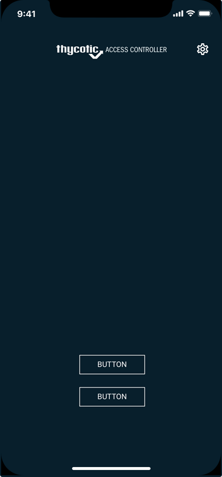
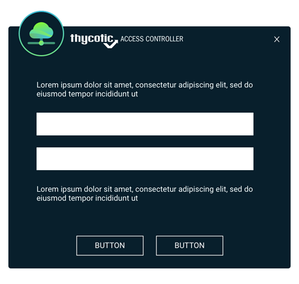
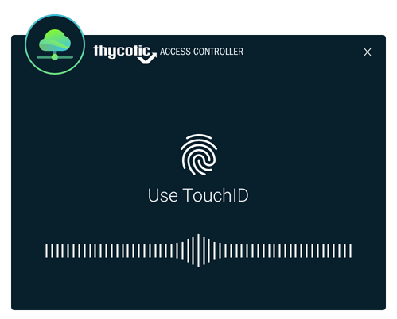

[title]: # (Mobile Setup)
[tags]: # (setup)
[priority]: # (2)
# Mobile Devices

Now, please return to your email and locate the two emails that are depicted below. These two
emails contain a link each that redirect your computer to the appropriate Apple or Android application stores. Please open these emails using your smart phone. Then click the link in the email, from your smart phone email client.

Once you click the link in the email, from your smart phone, you will be able to visit the appropriate
iOS or Google Play store and download the Thycotic smart phone application. 

The application will assist you in performing 2FA and verify your identity. You will need to enter your phone number (usually, your smart phone number) and the registration code that was originally sent to you by Thycotic in the first email.

For the Thycotic Access Control application to perform as expected on your phone, please click on __Allow__ when prompted for permissions during the application installation on your smart phone.

Congratulations! You have now completed the second stage of the registration process. You have successfully registered the smart phone application, tied your identity with the application. This will help you. If you have any question, please let us know at support@onionid.com.

<!--
## Next Steps Example

Your experience with Thycotic Access Control depends heavily on how your IT administrator has configured Thycotic Access Control for use in your corporate environment. We will go through a common scenario where you can see how the system is supposed to function and hence can familiarize yourself with Thycotic Access Control.

Thycotic Access Control saves you time and effort when logging into various corporate applications. Please open your browser (the one where you have installed the Thycotic Access Control browser extension) and visit a popular website like twitter.com . Once you visit this site, depending on the settings that your IT administrator may have set up with Thycotic Access Control, you may see a popup asking you to use your smart phone to verify your identity.

Furthermore, you may receive a push message on your phone. You should click on the push message
on your iPhone or Android phone and it will open up the Thycotic Access Control smart phone app. The smart phone app will ask you to use you fingerprint, or use the GPS information from your phone or another mechanism to verify your identity. As soon as the smart phone application responds back to Thycotic Access Control, with the correct input, the pop up on the screen will change and allow you to enter your username and password for the very first time. Please enter your username and password and __click__ on the __Register__ button.

From now on, Thycotic Access Control will help you login to this website, rotate your passwords, implement string identity verifications on logins and you can safely and easily access the web application. We depict below the various screens you will see during this first login process.

Thycotic Access Control also helps end users login to servers using SSH and RDP. These are advanced features and need to be enabled by the IT administrators. If these are enabled, you may be sent an email by Thycotic Access Control asking you to upload you Public SSH key. Once you do so you will be able to access a server over SSH using a very easy format. Simply go to your command line and type in the ssh command which follows the format below:
`$> ssh your_username~target_account_username~target_server@ssh.onionid.com:2222`

We are now going to explain the above command. The above ssh command should use your default
__identity__ for the ssh connection. If you have multiple SSH keys, please use the __-i__ parameter to point out the correct private key corresponding to the public key that you have uploaded to Thycotic Access Control. As an example you might want to use __-i ~/id_rsa__ .

your_username should be replaced with your linux/unix username - such as ab123 target_account_username should be replaced with the account on the target server like, root target_server should be replaced with the IP address or DNS name of the target server In essence your command should look something like
`$> ssh anirban~demo1~demo1.onionid.net@ssh.onionid.com:2222`

Once you press enter you may receive a push message on your smart phone. Once you verify your
identity using your smart phone, Thycotic Access Control will log you into the target server. This will help you never have to remember passwords, manage keys and helps save you time and effort.
Additionally, Thycotic has created a library of 1-3 minute videos to help end users understand and
familiarize themselves with the various aspects of Thycotic Access Control. The videos can be found on the Thycotic Youtube channel. This Youtube channel is available here - https://www.youtube.com/c/
OnionIDOfficial

## Beginner

How to register yourself with Thycotic - https://youtu.be/tSUSsBlQXGc
How to register credentials for the first time - https://youtu.be/d8fe7QQBB_g
How to use the smartphone app - https://youtu.be/R0n2cwxDLW8
An example of Geofencing - https://youtu.be/ZaSUedhxGe8

## Intermediate

How to set up an application - https://youtu.be/TN-p-Yb0vz4 - Only for administrators
How to set up users - https://youtu.be/Gb3PjNuy4Jo - Only for administrators
How to set up a policy - https://youtu.be/-a_zIrwUDZM - Only for administrators
How to reset password for an app with Thycotic - https://youtu.be/PzjI7nrbBog
How to see daily email reports - https://youtu.be/r7d-BHj0a2Q
How to delete credentials or update credentials for an application with Thycotic - https://youtu.be/
078q2AsdZ9Q

## Advanced

How to use yubikeys with Thycotic - https://youtu.be/YxT4NUImNNs
How to filter specific websites with Thycotic - https://youtu.be/Mo8vhwYXE74 - Only for administrators
How to do adaptive Multi factor Authentication with Thycotic - https://youtu.be/cd4TZ0bjzRc
How to use the Thycotic smartphone app to recover a password - https://youtu.be/FLetNrew510
How to set up password strength requirements for apps with Thycotic - https://youtu.be/ITM4PvvR7Qo - Only for administrators
-->
